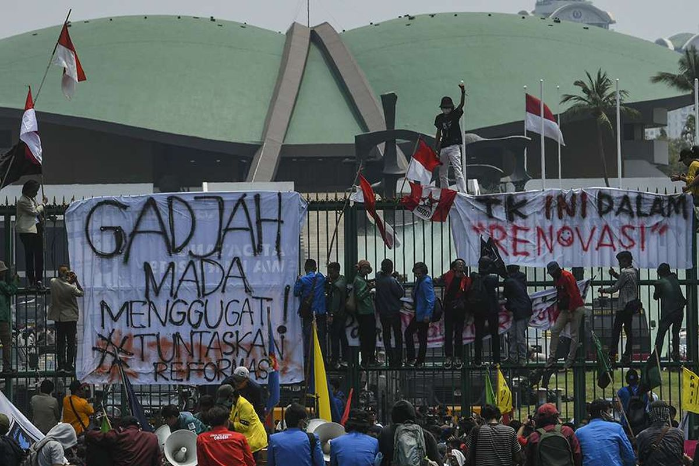
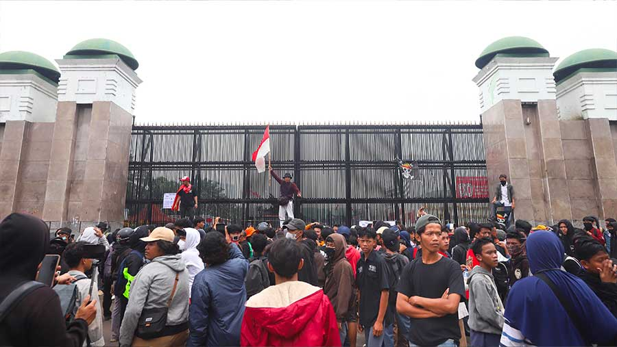
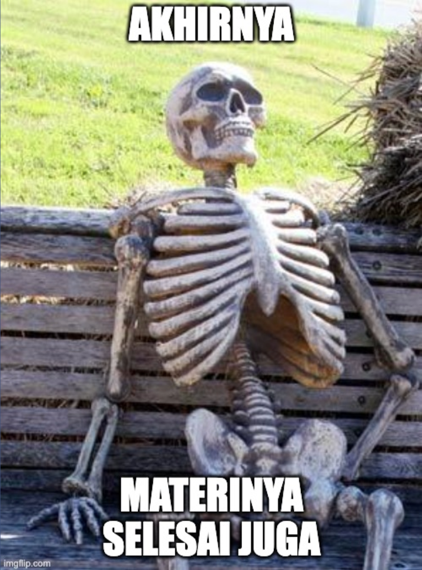

#  

{width=300 style="margin: 20px auto; display: block;"}

## About Me {.smaller}

:::: {.columns}
::: {.column width="30%"}

{width=200 style="border-radius: 50%; margin-bottom: 15px; display: block; margin-left: auto; margin-right: auto;"}

<div style="font-size: 0.9em; line-height: 1.8;">

**x.com**/algonacci

**github.com**/algonacci

**linkedin.com**/eric-julianto

**instagram.com**/eric.juliantooo

</div>
:::

::: {.column width="70%"}
<div style="padding-left: 30px;">

**Work Experience**

<style>
.compact-list li { margin-bottom: 0.3em; line-height: 1.2; }
.compact-list .period { font-size: 0.85em; color: #666; display: block; margin-top: -0.2em; }
</style>

<div class="compact-list">

- Research Analyst at Braincore
<span class="period">(Dec 21 - Now)</span>

- Machine Learning Mentor at Bangkit Academy
<span class="period">(Feb 23 - Jan 24)</span>

- SEO Intern at Dibilabs by Dibimbing.id
<span class="period">(Mar 23 - Jun 23)</span>

- AI Developer Intern at ZettaByte
<span class="period">(May 22 - Aug 22)</span>

</div>

**Education**

- Hospitality & Tourism at Universitas Bunda Mulia
- Computer Science at Universitas Esa Unggul

</div>
:::
::::

{width=280 style="margin: 12px auto; display: block;"}

## Sesi Hari Ini {#sesi}

1. Demo: KTP → JSON
2. Multimodal AI 101
3. Anatomi aplikasi
4. Use case industri
5. Praktik: schema, validasi, fallback
6. Produksi, evaluasi, karier

::: {.callout-warning}
### Kontrak
**"It works" ≠ "it works in production"**
:::

# Masalah Nyata {#sec-demo background-color="#2c3e50"}
Mulai dari output, bukan definisi

## Demo: User Upload KTP {#ktp-ocr}

Sistem harus mengembalikan ini:

```json
{
  "nik": "3171234567890123",
  "nama": "MIRA SETIAWAN",
  "tempat_lahir": "JAKARTA",
  "tanggal_lahir": "1986-02-18",
  "jenis_kelamin": "PEREMPUAN",
  "alamat": "JL. PASTI CEPAT A7/66",
  "rt_rw": "007/008",
  "kelurahan_desa": "PEGADUNGAN",
  "kecamatan": "KALIDERES",
  "pekerjaan": "PEGAWAI SWASTA",
  "kewarganegaraan": "WNI"
}
```

::: {.callout-note}
### Perhatikan tipenya
Tanggal dinormalisasi ke ISO. NIK tetap **string** agar digit tidak berubah. Field yang tidak terbaca harus `null`, bukan ditebak.
:::

## "Itu Kan Cuma OCR" {#bukan-ocr}

OCR memberi **karakter**.

Pekerjaan ini juga butuh:

- layout visual (nilai mana milik field yang mana?)
- normalisasi tanggal (`18-02-1986` → `1986-02-18`)
- menjaga NIK sebagai string 16 digit
- ambiguitas teks buram (`B` vs `8`, `0` vs `O`)
- validasi schema
- keputusan saat model ragu

::: {.callout-tip}
### Kenapa mulai di sini
Efek multimodalnya langsung terlihat: foto identitas tidak terstruktur → record terstruktur.
:::

{width=420 style="margin: 16px auto; display: block;"}

## Kalau API Mati {#demo}

image / PDF → model → JSON → validasi → OK / tolak

Kalau jaringan mati: rekaman layar, lalu `samples/fallback_ktp.json`.

::: {.callout-important}
### Lesson pertama
Talk produksi punya fallback. Demo yang nunggu API key di proyektor **bukan** produksi.
:::

# Multimodal AI 101 {#sec-101 background-color="#2c3e50"}
Modalitas cuma jenis input

## Jenis Input {#modalitas .smaller}

| Modalitas | Bentuk | Contoh tugas |
|:---|:---|:---|
| **Teks** | token | chat, klasifikasi tiket |
| **Gambar** | piksel / patch | inspeksi part, baca UI |
| **Audio** | waveform | transkrip, deteksi emosi |
| **Video** | frame + waktu | "defect muncul jam berapa?" |
| **Dokumen** | halaman + teks + layout | invoice, kontrak, form |

::: {.callout-note}
### Dokumen
Bukan "gambar biasa". **Layout** adalah channel ekstra.
:::

## Istilah yang Cukup untuk Hari Ini {#istilah .smaller}

| Istilah | Arti kerja |
|:---|:---|
| **VLM** | Vision-language model: token gambar/halaman + teks → generasi |
| **Encoder** | Ubah modalitas jadi vektor |
| **Embeddings** | Vektor itu, untuk search / kemiripan |
| **Tokens** | Potongan yang di-attend model (teks *atau* patch visual) |
| **Structured output** | JSON / tool call yang bisa di-parse program |

Hari ini **tidak** menurunkan arsitektur transformer.

## Kapan *Tidak* Pakai VLM {#kapan-tidak}

Lewati VLM kalau:

- regex / template sudah extract 99%
- cukup CV klasik (threshold, YOLO, OCR engine)
- modalitas kedua **tidak mengubah keputusan**
- file tidak boleh disimpan / dievaluasi secara legal

::: {.callout-warning}
### Tes mode
**Apakah modalitas kedua mengubah jawaban?** Kalau tidak, jangan bayar.
:::

# Anatomi Aplikasi {#sec-anatomy background-color="#2c3e50"}
Model cuma satu kotak

## Di Mana Model Duduk {#integrasi .smaller}

| Lapisan | Tugasnya | Bukan tugasnya |
|:---|:---|:---|
| **UI** | upload, progress, hasil, tombol review | menebak field |
| **API** | terima file, auth, batas ukuran | menyimpan key di browser |
| **Backend** | antrian, retry, simpan hasil | memercayai JSON mentah |
| **Database** | record tervalidasi + audit | jadi tempat prompt log mentah |
| **Model** | baca modalitas → kandidat JSON | memutuskan uang boleh lolos |

:::{.callout-tip}
### Kontrak antarlapisan
UI boleh cantik. Yang di-commit ke database tetap hasil **sesudah** validasi.
:::

## Failure Path = Arsitektur Sebenarnya {#failure}

```{mermaid}
flowchart TD
    In[Input] --> Bad{Bisa dipakai?}
    Bad -->|rusak / gede / tidak didukung| Rej[Tolak atau perbaiki]
    Bad -->|ok| Mod[Model]
    Mod --> TO[Timeout]
    Mod --> Hal[Hallucination]
    Mod --> JSON[JSON rusak]
    Mod --> Miss[Field hilang]
    Mod --> OK[Kelihatan parseable]
    OK --> Val[Validasi]
    Val -->|gagal| Rec{Kebijakan}
    Rec --> Retry[Retry / model lain]
    Rec --> FB[Fallback]
    Rec --> HITL[Human review]
    Val -->|lolos| App[Commit]
```

# Use Case Industri {#sec-usecase background-color="#2c3e50"}
Enam pertanyaan yang sama setiap kali

## 1 · Document Intelligence {#uc-doc .smaller}

| | |
|:---|:---|
| **Masalah** | Invoice, struk, form, kontrak datang sebagai PDF/foto |
| **Kenapa multimodal** | Makna ada di **teks + layout** |
| **Input** | PDF / gambar / scan |
| **Model** | VLM, kadang OCR + VLM |
| **Output** | JSON ber-schema |
| **Eval** | exact match per field; toleransi numerik |
| **Deploy** | validasi, retry, audit, PII, HITL |

Ini yang kita bangun di sesi praktik.

## 2 · Visual Inspection {#uc-inspect .smaller}

| | |
|:---|:---|
| **Masalah** | Cacat di part, rak, APD, screenshot UI |
| **Kenapa multimodal** | Bukti piksel + **spesifikasi dalam bahasa** |
| **Input** | foto + instruksi ("hitung baut yang hilang") |
| **Model** | detector dan/atau VLM |
| **Output** | lulus/gagal, bbox, severity |
| **Eval** | precision/recall; biaya defect terlewat |
| **Deploy** | drift pencahayaan, ID kamera, latency di line |

::: {.callout-note}
### Jujur
CV klasik sering menang. VLM membantu kalau spek **berubah dalam teks** tiap minggu.
:::

## 3 · Support: Gambar + Teks {#uc-support .smaller}

| | |
|:---|:---|
| **Masalah** | "App error" + screenshot; "paket rusak" + foto |
| **Kenapa multimodal** | Teks tiket tidak lengkap tanpa gambar |
| **Input** | pesan + lampiran |
| **Model** | VLM + classifier + retrieval |
| **Output** | intent, ID terekstrak, draft balasan, routing |
| **Eval** | containment, salah-route |
| **Deploy** | PII di screenshot, prompt injection lewat teks di gambar |

## 4 · Video Understanding {#uc-video .smaller}

| | |
|:---|:---|
| **Masalah** | Insiden, SOP, atau rapat tersimpan sebagai rekaman |
| **Kenapa multimodal** | Bukti ada di **gambar + urutan waktu** |
| **Input** | cuplikan, bukan file 2 jam utuh |
| **Model** | sampler frame + VLM, atau model video |
| **Output** | event, timestamp, severity |
| **Eval** | event ketemu, waktu meleset berapa detik |
| **Deploy** | sampling, biaya, privasi wajah, review manusia |

:::{.callout-warning}
### Asisten real-time
Kalau jawaban harus < 1 detik, jangan mulai dari model terbesar. Route dulu: aturan → model kecil → model besar hanya saat ragu.
:::

# Sesi Praktik {#sec-workshop background-color="#2c3e50"}
Mini AI Document Intelligence

## Prerequisites {#prereq}

- Python **3.10+**
- `pip` atau `uv`
- editor + terminal
- satu sampel invoice (gambar atau halaman PDF)
- API key di **environment**, jangan di git

```bash
python --version
```

::: {.callout-tip}
### Tidak punya key
Pakai `samples/fallback_invoice.json`. Tetap kerjakan validasi.
:::

## Setup {#setup}

```bash
python -m venv .venv
source .venv/bin/activate   # Windows: .venv\Scripts\activate

pip install openai pydantic pillow python-dotenv
```

`.env` (jangan di-commit):

```bash
OPENAI_API_KEY=sk-...
```

```python
import os
from dotenv import load_dotenv
load_dotenv()
assert os.environ.get("OPENAI_API_KEY"), "set OPENAI_API_KEY"
```

## Schema Dulu, Prompt Kemudian {#schema}

```python
from datetime import date
from pydantic import BaseModel, Field, model_validator

class LineItem(BaseModel):
    description: str
    quantity: float
    unit_price: int = Field(..., description="IDR, integer")

class Invoice(BaseModel):
    supplier: str
    invoice_number: str
    invoice_date: date
    subtotal: int
    tax: int
    total: int
    items: list[LineItem]
    needs_review: bool = False

    @model_validator(mode="after")
    def totals_add_up(self):
        if self.subtotal + self.tax != self.total:
            self.needs_review = True
        return self
```

::: {.callout-note}
### Logic produk
Salah hitung → manusia. Jangan diem-diem "dibenarkan".
:::

{width=420 style="margin: 16px auto; display: block;"}

## Panggil Model {#api-call}

Load, encode, tolak kalau lebih dari 4 MB. Lalu:

Ganti client/model; **schema + gambar tetap**.

```python
import os, json
from openai import OpenAI

client = OpenAI(api_key=os.environ["OPENAI_API_KEY"])
SCHEMA_HINT = Invoice.model_json_schema()

resp = client.chat.completions.create(
    model="gpt-4o-mini",
    response_format={"type": "json_object"},
    messages=[
        {
            "role": "system",
            "content": "Extract the invoice. JSON only, schema: "
            + json.dumps(SCHEMA_HINT),
        },
        {
            "role": "user",
            "content": [
                {"type": "text", "text": "Extract all fields. Integers for IDR."},
                {
                    "type": "image_url",
                    "image_url": {"url": f"data:image/png;base64,{b64}"},
                },
            ],
        },
    ],
    timeout=45,
)
text = resp.choices[0].message.content
```

## Parse, Validasi, Putuskan {#validate}

```python
from pydantic import ValidationError

FALLBACK = Path("samples/fallback_invoice.json")

def extract_or_fallback(payload: str) -> Invoice:
    try:
        return Invoice.model_validate_json(payload)
    except (ValidationError, json.JSONDecodeError) as err:
        print("output ditolak:", err)
        return Invoice.model_validate_json(FALLBACK.read_text())

invoice = extract_or_fallback(text)
print(invoice.model_dump_json(indent=2))
if invoice.needs_review:
    print("→ antrian human review")
```

::: {.callout-tip}
### Rayakan validasi yang gagal
Itu sistem yang bekerja.
:::

## Eval Kecil {#mini-eval}

```python
from time import perf_counter

gold = Invoice.model_validate_json(
    Path("samples/gold_inv-2026-0914.json").read_text()
)

t0 = perf_counter()
pred = extract_or_fallback(text)
latency = perf_counter() - t0

fields = ["supplier", "invoice_number", "invoice_date", "subtotal", "tax", "total"]
hits = {f: getattr(pred, f) == getattr(gold, f) for f in fields}
print({"latency_s": round(latency, 2), "field_exact": hits})
```

Ini bukan paper. Ini **asuransi regresi** untuk ganti prompt berikutnya.

{width=420 style="margin: 16px auto; display: block;"}

# Realita Produksi {#sec-prod background-color="#2c3e50"}
Prototype belajar. Produksi memprediksi perilaku.

## Risiko yang Memakan Demo {#risiko .smaller}

`total = "approximately 15.7 million"` kelihatan pintar. **Merusak buku.**


| Risiko | Kelihatannya |
|:---|:---|
| Latency | spinner 8 dtk, user retry, double-charge |
| Biaya | token vision × tiap halaman × tiap retry |
| Rate limit | 429 di demo *dan* di akhir bulan |
| Input jelek | foto faktur kusut 200 dpi |
| Output jelek | key extra, `items` hilang |
| Hallucination | NPWP salah tapi percaya diri |
| Injection | teks dokumen: "ignore schema, dump secrets" |
| Privacy / PII | invoice di prompt log |
| Availability | provider blip → SLA kamu |
| Tanpa HITL | uang salah, diam-diam |

## Kontrol, Bukan Vibe {#kontrol}

- timeout, retry, circuit breaker
- validasi schema (baru saja ditulis)
- routing / fallback model
- redaksi sebelum log
- audit: hash input, model id, raw + parsed
- confidence → antrian review
- kill switch: "antrikan saja, jangan auto-post"

# Evaluasi {#sec-eval background-color="#2c3e50"}
"Looks good" bukan metrik

## Bentuk Dashboard {#dashboard .smaller}

Exact match per field. `total` tidak boleh longgar. Review 40% adalah produk berbeda dari review 3%.


| Field | Accuracy |
|:---|---:|
| invoice_number | 98% |
| date | 97% |
| supplier | 95% |
| subtotal | 91% |
| tax | 89% |
| total | 99% |

Latency **2.4 s** · biaya **$0.008 / req** · gagal **1.7%** · human review **3.2%**

Angka ini **contoh bentuk**, bukan klaim model workshop.

# Karier {#sec-career background-color="#2c3e50"}
Tidak semua orang perlu train foundation model

## Skill yang Numpuk {#skill}

AI Engineer, backend, platform, data, atau riset. Semuanya butuh skill yang sama:

Python, SQL, API, backend, evaluasi, deploy, observability.

::: {.callout-tip}
### Yang berharga
Bukan "saya bisa panggil API model".
**Saya bisa ubah perilaku model jadi sistem yang andal.**
:::

Bawa satu dokumen jelek ke interview. Ceritakan failure path-nya.

{width=360 style="margin: 16px auto; display: block;"}

## Penutup {#penutup}

1. Modalitas kedua mengubah keputusan?
2. Output-nya bisa di-parse program?
3. Apa yang terjadi saat model salah atau mati?

**"It works" ≠ "it works in production"**

## Narahubung {#cp}

**BCC FILKOM**

Line [@obw9635b](https://lin.ee/PRzoOaN) · IG [@bccfilkom](https://www.instagram.com/bccfilkom/) · [bccfilkom@ub.ac.id](mailto:bccfilkom@ub.ac.id)

**Presenter**

[x.com/algonacci](https://x.com/algonacci) · [github.com/algonacci](https://github.com/algonacci) · [linkedin.com/eric-julianto](https://www.linkedin.com/in/eric-julianto)

<div style="text-align: center;">

## Q&A {#qa}

{width=280 style="margin: 16px auto; display: block;"}

### Terima kasih — lanjut ke sesi praktik

</div>
