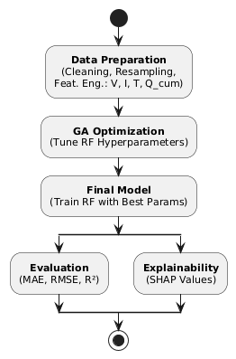
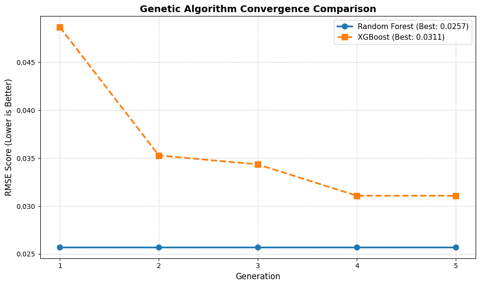
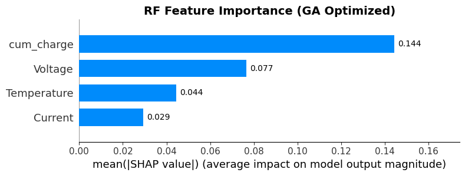
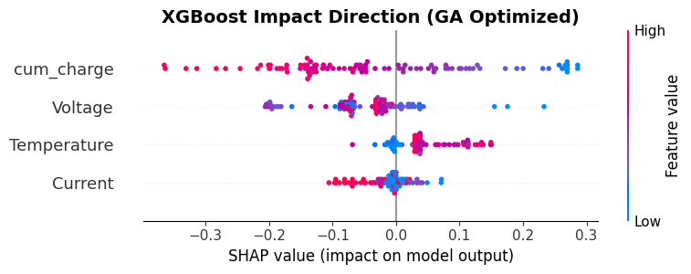

## Introduction {.smaller}

:::: {.columns}
::: {.column width="55%"}
### Why BMS Matters
- **Battery Management Systems (BMS)** govern Li-ion batteries in EVs and renewable storage.
- **State-of-Charge (SoC)** is the battery's "fuel gauge" — cannot be measured directly, only estimated.
:::
::: {.column width="45%"}
### Why SoC Accuracy Helps
- **Safety** — prevents overcharge / over-discharge.
- **Longevity** — preserves cell health across cycles.
- **User experience** — reduces EV *range anxiety*.
:::
::::

---

## Problem Statement {.smaller}

:::: {.columns}
::: {.column width="33%"}
### Cell Complexity
- Li-ion cells are strongly non-linear.
- Physics-based models (ECM, Kalman) degrade with aging.
:::
::: {.column width="33%"}
### Black-Box ML
- Deep learning is accurate but hard to interpret.
- Not trustworthy for *safety-critical* BMS.
:::
::: {.column width="33%"}
### Manual Tuning
- Grid search is expensive.
- Manual tuning → local-minima entrapment.
- Many studies rely on defaults.
:::
::::

---

## Contributions {.smaller}

::: {.callout-important}
## An Integrated, Reproducible Pipeline
:::

:::: {.columns}
::: {.column width="33%"}
### 1. GA Optimization
Gradient-free hyperparameter optimization.
:::
::: {.column width="33%"}
### 2. Ensemble Models
Random Forest and XGBoost as predictors.
:::
::: {.column width="33%"}
### 3. SHAP
Game-theoretic feature attribution.
:::
::::

> Prior work addresses optimization and interpretability in isolation. This framework **jointly delivers predictive accuracy and feature-level transparency** — a requirement for safety-critical BMS.

---

## Methodology Framework {.smaller .methodology-slide}

:::: {.columns}
::: {.column width="56%"}
### Five-Stage Pipeline
1. **Data preprocessing** — cleaning, normalization, feature engineering.
2. **Model training** — RF and XGBoost baselines.
3. **GA hyperparameter optimization** — fitness = validation RMSE.
4. **Evaluation** — RMSE, MAE, $R^2$ on held-out test set.
5. **SHAP interpretation** — feature contributions to SoC.
:::
::: {.column width="44%"}
{width=60%}
:::
::::

---

## Dataset {.smaller}

:::: {.columns}
::: {.column width="55%"}
### Data Source
Commercial Li-ion pouch cells, high-precision cycler, public dataset.

| Parameter | Unit | Range | Mean |
|:---|:---:|:---:|:---:|
| Time | s | 0 → 307,513 (~85h) | — |
| Current | A | −20.15 → +33.20 | −0.16 |
| Voltage | V | 2.998 → 4.209 | 3.85 |
| Temperature | °C | 25.1 → 28.1 | 26.3 |
:::
::: {.column width="45%"}
### Two Subsets
- **Fresh cell** — 358,309 samples, nominal capacity.
- **Aged cell** — 307,513 samples, reduced capacity and altered impedance.

### Total
**665,822 measurement points** spanning ~85 hours of operation.
:::
::::

---

## Dataset Split {.smaller}

:::: {.columns}
::: {.column width="55%"}
### Fresh Train, Aged Test

| Subset | Source | Samples |
|:---|:---|:---:|
| Training | Fresh (80%) | 286,647 |
| Validation | Fresh (20%) | 71,662 |
| Testing | Aged (100%) | 307,513 |
| **Total** | Fresh + Aged | **665,822** |

*Fixed seed (`42`) for full reproducibility.*
:::
::: {.column width="45%"}
::: {.callout-tip}
## Cross-Distribution Test
The model trains on healthy cells and is evaluated on degraded ones — a stricter generalization test than random splitting.
:::
:::
::::

---

## Dataset Balance {.smaller}

:::: {.columns}
::: {.column width="55%"}
### Charging vs Discharging

| Condition | Samples | Percentage |
|:---|:---:|:---:|
| Charging ($I > 0$) | 312,312 | 46.9% |
| Discharging ($I < 0$) | 349,908 | 52.6% |
| Rest ($I = 0$) | 3,602 | 0.5% |
| **Total** | **665,822** | **100.0%** |
:::
::: {.column width="45%"}
> The dataset is **approximately balanced**, supporting unbiased training across both operating regimes.

The balance is verified from the sign of the instantaneous current signal prior to training.
:::
::::

---

## Feature Engineering {.smaller}

:::: {.columns}
::: {.column width="55%"}
### Input Features $X$
- **Voltage ($V$)** — instantaneous terminal voltage.
- **Current ($I$)** — charging if positive, discharging if negative.
- **Temperature ($T$)** — cell surface temperature.
- **Cumulative Charge ($Q_{cum}$)** — Coulomb integration:

$$Q_{cum}(t) = \int_{0}^{t} I(\tau)\, d\tau$$
:::
::: {.column width="45%"}
### Target $y$
Ground-truth **SoC** from hybrid Coulomb counting + OCV correction.

### Normalization
Min-Max scaling to $[0, 1]$ applied to all features.
:::
::::

---

## Why Genetic Algorithm {.smaller}

:::: {.columns}
::: {.column width="50%"}
### Why GA?
- Hyperparameter space is non-convex and tightly coupled.
- Grid search: combinations explode.
- Manual tuning: prone to local-minima entrapment.
:::
::: {.column width="50%"}
### GA as Evolution
- **Population-based** — many candidates in parallel.
- **Gradient-free** — no loss derivatives required.
- **Global search** — exploration (mutation) + exploitation (selection).
:::
::::

---

## Genetic Algorithm: Workflow {.smaller}

:::: {.columns}
::: {.column width="50%"}
### Six Steps
1. **Initialization** — random population of 10.
2. **Fitness Evaluation** — validation RMSE.
3. **Selection** — keep top performers.
4. **Crossover + Mutation** — mutation rate 0.1.
5. **Elitism** — top 2 preserved across generations.
6. **Iteration** — 5 generations to convergence.
:::
::: {.column width="50%"}
### GA Configuration
- **Population size**: 10 candidates.
- **Generations**: 5.
- **Mutation rate**: 0.1.
- **Fitness objective**: validation RMSE minimization.
- **Best use case**: expensive search spaces with coupled hyperparameters.
:::
::::

---

## Genetic Algorithm: Search Space {.smaller}

:::: {.columns}
::: {.column width="50%"}
### Random Forest
- **RF**: `n_estimators`, `max_depth`, `min_samples_split/leaf`, `max_features`.
:::
::: {.column width="50%"}
### XGBoost
- **XGBoost**: `n_estimators`, `max_depth`, `learning_rate`, `subsample`, `colsample`, `gamma`, `reg_alpha`, `reg_lambda`.

> XGBoost exposes a wider and more tightly coupled search space, which helps explain why metaheuristic tuning yields strong gains.
:::
::::

---

## Experimental Setup {.smaller}

:::: {.columns}
::: {.column width="50%"}
### Scenarios

| Scenario | Description |
|:---|:---|
| RF Baseline | Default hyperparameters |
| RF-GA | RF + Genetic Algorithm |
| XGB Baseline | Default hyperparameters |
| XGB-GA | XGBoost + Genetic Algorithm |
:::
::: {.column width="50%"}
### Metrics
- **RMSE** — sensitivity to large errors.
- **MAE** — mean absolute error magnitude.
- **$R^2$** — variance explained.
- **Training Time** — computational cost in seconds.
:::
::::

---

## Results: Accuracy {.smaller}

| Model | Config | MAE | RMSE | $R^2$ |
|:---|:---:|:---:|:---:|:---:|
| Random Forest | Baseline | 0.1012 | 0.1829 | 0.4242 |
| **Random Forest** | **GA-Optimized** | **0.0035** | **0.0257** | **0.9885** |
| XGBoost | Baseline | 0.1015 | 0.1710 | 0.4968 |
| XGBoost | GA-Optimized | 0.0084 | 0.0311 | 0.9832 |

::: {.callout-note}
## Key Message
$R^2$ increases from **~0.42--0.50** to **~0.98--0.99** after GA tuning, with **RF-GA** delivering the best overall accuracy.
:::

---

## Results: Training Time {.smaller}

:::: {.columns}
::: {.column width="55%"}
| Model | Optimization | Time (s) |
|:---|:---|:---:|
| RF baseline | default | 44.27 |
| RF-GA | Genetic Algorithm | 2,633.01 |
| XGB baseline | default | 6.55 |
| **XGB-GA** | **Genetic Algorithm** | **332.05** |
:::
::: {.column width="45%"}
### Insights
- **XGB-GA ≈ 8× faster** than RF-GA.
- **RF-GA** — preferred for maximum accuracy (offline calibration).
- **XGB-GA** — preferred for periodic retraining or near-real-time scenarios.
:::
::::

---

## Optimization Insights {.smaller}

:::: {.columns}
::: {.column width="50%"}
### Why GA Works
- Crossover and mutation explore distant regions of the hyperparameter landscape.
- Selection pressure exploits high-fitness configurations.
- Avoids local-minima traps typical of grid/manual tuning.
:::
::: {.column width="50%"}
### Why XGBoost Benefits
- Parameters are tightly coupled: *learning rate*, *depth*, *subsample*, regularization.
- Analytical resolution of interactions is intractable.
- GA navigates them efficiently → balanced bias–variance.
:::
::::

---

## Explainability Insights {.smaller}

:::: {.columns}
::: {.column width="50%"}
### Why SHAP Matters
- Decomposes each prediction into additive feature contributions.
- Consistent with **Shapley game-theoretic axioms**.
- Engineers can verify the model relies on physically meaningful signals (V, I, T) — not spurious correlations.
:::
::: {.column width="50%"}
### Impact on Deployment
- Supports **fault diagnosis** during operation.
- Enables **regulatory compliance** audits.
- Builds **trust calibration** when deployed alongside Coulomb-counting or Kalman-filter baselines.
:::
::::

---

## GA Convergence {.smaller}

{width=95%}

*Population = 10 · Generations = 5 · Mutation = 0.1 · Elitism = 2.*

- RMSE drops steeply in early generations.
- Later generations show diminishing returns.
- Five generations were sufficient for practical convergence.

---

## Explainable AI — RF-GA {.smaller}

:::: {.columns}
::: {.column width="55%"}
{width=95%}
:::
::: {.column width="45%"}
### Feature Ranking
1. **Voltage ($V$)** — dominant predictor, directly correlated with SoC via OCV.
2. **Temperature ($T$)** — corrective role across the 25–40°C range.
3. **Current ($I$) and $Q_{cum}$** — provide charging / discharging context.
:::
::::

---

## Explainable AI — XGB-GA {.smaller}

:::: {.columns}
::: {.column width="55%"}
{width=95%}
:::
::: {.column width="45%"}
### Observations
- Both models prioritize **voltage** as the top predictor.
- Secondary-feature ordering differs — reflecting the distinct mechanisms of **bagging (RF)** vs **boosting (XGB)**.
- Models learn **physically meaningful relationships**, not noise.
:::
::::

---

## Limitations {.smaller}

:::: {.columns}
::: {.column width="50%"}
### Data & Evaluation
- **Single dataset** — cross-cell (fresh→aged) provides partial generalization, but cross-chemistry validation is still required.
- **Long-term degradation** effects not explicitly modeled.
:::
::: {.column width="50%"}
### Method & Deployment
- **Offline GA cost** — repeated retraining across generations.
- **Post-hoc SHAP** — feature attribution, not causal inference.
- **Real-time deployment** on MCU not empirically validated.
:::
::::

---

## Real-world Implementation {.smaller}

:::: {.columns}
::: {.column width="50%"}
### Deployment Path
1. **Offline** — training + GA optimization on server hardware.
2. **Export** — XGBoost → **ONNX** or compiled C via **`treelite`**.
3. **On-target** — automotive-grade MCUs with limited memory and deterministic latency.
4. **Diagnostics** — SHAP precomputed offline for logging.
:::
::: {.column width="50%"}
### Why It Is Feasible
- Training remains **offline**, so embedded devices only run inference.
- Tree ensembles can be compressed and exported efficiently.
- Explainability artifacts can be generated before deployment.
:::
::::

---

## Future Work {.smaller}

### Engineering Next Steps
- On-target MCU benchmarking.
- Online adaptation to cell aging.

### Research Extension
- Validation across realistic drive-cycle profiles.
- Multi-chemistry and multi-form-factor evaluation.

---

## Conclusion {.smaller}

:::: {.columns}
::: {.column width="50%"}
### Key Findings
- **GA optimization is essential**: $R^2$ jumps from <0.50 to >0.98.
- **Clear trade-off**: RF-GA peak accuracy vs XGB-GA $8\times$ faster training.
- **SHAP validates** voltage & temperature as *physically plausible* predictors.
:::
::: {.column width="50%"}
### Takeaways
- **Unified pipeline**: GA + ensemble ML + SHAP for safety-critical BMS.
- **Deployment-ready** via lightweight export paths (ONNX / treelite).
- Opens the door for interpretable SoC estimation in production-grade BMS.
:::
::::

---

## Thank You {.smaller}

::: {.callout-note}
## Open Q & A
Questions and discussion are welcome.
:::

**Eric Julianto · Dian Alhusari · Safrizal Ardana Ardiyansa**

*Braincore Indonesia · Universitas Esa Unggul · Universitas Brawijaya*
