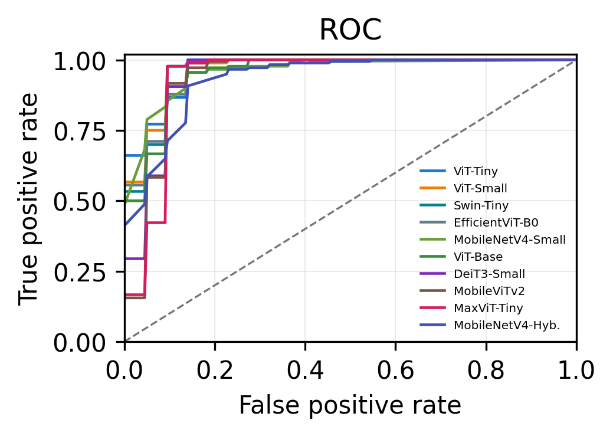
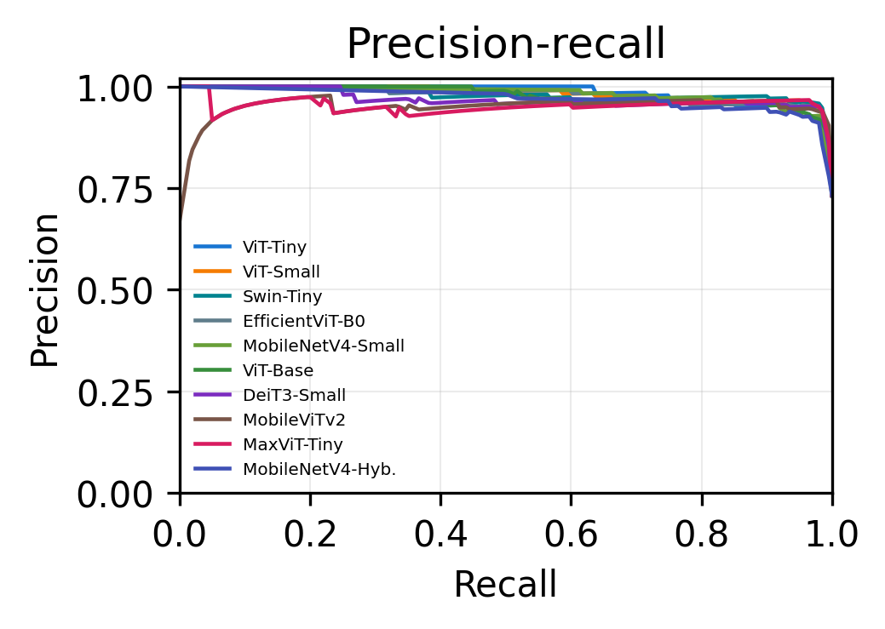
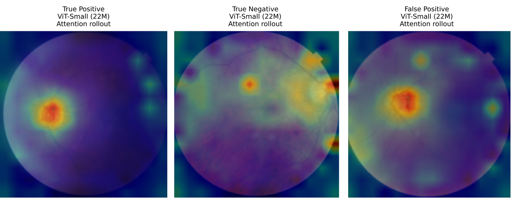

# Outline {background-color="#2c3e50"}

1. Motivation & Research Gap

2. Dataset & Benchmark Design

3. Results: the top cluster is not separable

4. Efficiency & Deployment Implications

5. Limitations & Conclusion

# Background & Motivation {.smaller}

- **Glaucoma** is a leading cause of *irreversible* blindness — optic-nerve damage is progressive and permanent

- Projected to rise from **64 million** cases in 2013 to about **112 million by 2040** [@tham2014global]

- Many cases stay undetected until substantial damage has occurred

- **Color fundus photography** is non-invasive and low cost — but manual assessment does not scale in high-volume screening

::: center
 
> **Key question:** which backbone family should carry an automated screening tool?
:::

# Research Gap & Contributions {.smaller}

::: columns
::: {.column width="48%"}

**The problem with the literature**

- Reported performance shifts with camera, image quality, labeling, and population

- Transformer vs.\ lightweight comparisons are drawn **across studies**, with different datasets and pipelines

- Image-level splits let the **same patient** appear in train and test

:::
::: {.column width="48%"}

**What we do instead**

- **Ten backbones**, one dataset, one protocol

- **Patient-level split** — no patient crosses the boundary

- Identical preprocessing, optimizer, schedule, and checkpoint rule

- Three seeds, plus bootstrap CIs and significance testing

:::
:::

# Dataset & Patient-Level Split {.smaller}

::: columns
::: {.column width="52%"}

**Hillel Yaffe Glaucoma Dataset** [@hillelyaffe2024glaucoma]

- **747** fundus images from **288** patients

- 548 GON-positive, 199 GON-negative

- TOPCON DRI OCT Triton, 45$^\circ$ field of view

- Full fundus used — no disc cropping, no masking, no quality filtering

:::
::: {.column width="44%"}

**Split at the patient level, 70:20:10**

| Subset | Patients | Images |
|:-------|-------:|-------:|
| Train | 201 | 494 |
| Validation | 57 | 171 |
| **Test** | **30** | **82** |

Audit found no mixed-label patients

:::
:::

::: center
*Patient-level grouping prevents same-patient leakage --- a stricter estimate than image-level splits*
:::

# Benchmark: Ten Backbones {.smaller}

::: columns
::: {.column width="46%"}

| Family | Model | Params |
|:-------|:------|-------:|
| Pure transformer | ViT-Base | 85.8 M |
| | ViT-Small | 21.7 M |
| | DeiT3-Small | 21.7 M |
| | ViT-Tiny | 5.5 M |
| Hierarchical / hybrid | MaxViT-Tiny | 30.4 M |
| | Swin-Tiny | 27.5 M |
| Lightweight / mobile | MobileNetV4-Hyb. | 9.8 M |
| | MobileViTv2-1.0 | 4.4 M |
| | MobileNetV4-Small | 2.5 M |
| | EfficientViT-B0 | 2.1 M |

:::
::: {.column width="50%"}

**One protocol for all ten**

- ImageNet-pretrained, head replaced, fine-tuned end to end

- AdamW, LR $10^{-4}$, weight decay $10^{-4}$, batch 16, 20 epochs, cosine annealing

- Seeds **42, 43, 44**

- Checkpoint chosen on **validation accuracy**, then evaluated **once** on the held-out test set

 

*A 40$\times$ parameter spread --- does capacity buy accuracy here?*

:::
:::

# Metrics & Evaluation {.smaller}

::: columns
::: {.column width="48%"}

**GON-positive is the positive class**

- **Sensitivity** is emphasized — a false negative is a missed glaucoma case

- Accuracy, specificity, PPV, NPV, balanced accuracy, F1

:::
::: {.column width="48%"}

**Beyond a single threshold**

- **ROC and precision--recall** curves are threshold-independent

- **Patient-clustered bootstrap** CIs — resample the 30 test patients, keep all their images

- **Exact McNemar** with Bonferroni correction

:::
:::

::: center
 
*The test cohort is small by design of the patient-level split --- so uncertainty must be quantified, not assumed*
:::

# Multi-Seed Performance {.smaller background-color="#f8f9fa"}

| Model | Params | Acc. | Sens. | F1 | AUC |
|:------|-------:|:----:|:-----:|:--:|:---:|
| **DeiT3-Small** | 21.7 M | **0.951** | **0.983** | **0.967** | 0.945 |
| **ViT-Small** | 21.7 M | **0.951** | 0.972 | 0.966 | 0.967 |
| MaxViT-Tiny | 30.4 M | 0.947 | 0.978 | 0.964 | 0.934 |
| Swin-Tiny | 27.5 M | 0.943 | 0.961 | 0.961 | 0.964 |
| MobileViTv2-1.0 | 4.4 M | 0.939 | 0.972 | 0.959 | 0.937 |
| ViT-Tiny | 5.5 M | 0.935 | 0.967 | 0.956 | **0.967** |
| EfficientViT-B0 | 2.1 M | 0.927 | 0.950 | 0.950 | 0.961 |
| MobileNetV4-Small | 2.5 M | 0.915 | 0.933 | 0.941 | 0.960 |
| ViT-Base | 85.8 M | 0.911 | 0.928 | 0.938 | 0.954 |
| MobileNetV4-Hyb. | 9.8 M | 0.906 | 0.950 | 0.937 | 0.934 |

::: center
*Mean over three seeds. Note the last-but-one row: the largest model is near the bottom.*
:::

# Threshold-Independent Behaviour {.smaller background-color="#f8f9fa"}

::: columns
::: {.column width="49%"}

{fig-align="center" width="100%"}

:::
::: {.column width="49%"}

{fig-align="center" width="100%"}

:::
:::

::: center
*Several transformer and compact backbones rank almost identically, even where threshold-based accuracy differs*
:::

# The Top Cluster Is Not Separable {background-color="#2c3e50" .smaller}

**82 images from 30 patients — a one percent accuracy difference is a single prediction changing.**

::: columns
::: {.column width="46%"}

**Bootstrap 95% CI on accuracy**

| Model | Interval |
|:------|:--------:|
| DeiT3-Small | [0.83, 0.96] |
| ViT-Small | [0.94, 1.00] |
| MaxViT-Tiny | [0.90, 0.99] |
| Swin-Tiny | [0.87, 0.98] |
| MobileViTv2 | [0.84, 0.96] |
| ViT-Tiny | [0.88, 0.99] |

:::
::: {.column width="50%"}

**Exact McNemar, 82 paired predictions**

| Model A | Model B | $p$ |
|:--------|:--------|:---:|
| ViT-Small | DeiT3-Small | 0.031 |
| ViT-Small | MaxViT-Tiny | 1.000 |
| ViT-Small | Swin-Tiny | 0.375 |
| DeiT3-Small | MaxViT-Tiny | 1.000 |
| DeiT3-Small | Swin-Tiny | 0.453 |
| MaxViT-Tiny | Swin-Tiny | 1.000 |

Bonferroni: $\alpha_{\text{corr}} = 0.05/6 \approx 0.0083$

:::
:::

::: center
::: {.slide-callout}
Intervals overlap broadly, no pair survives correction --- ranking by point accuracy would be reading noise
:::
:::

# So What Should Decide? {.smaller}

::: columns
::: {.column width="48%"}

**Capacity does not**

- **ViT-Base** is the largest model at 85.8 M parameters — and lands near the bottom

- DeiT3-Small and ViT-Small, at a quarter of that size, lead the table

- On a dataset of this size, extra capacity is not automatically useful

:::
::: {.column width="48%"}

**Efficiency and screening behaviour do**

- **Sensitivity** matters more than accuracy for screening — a missed case is the costly error

- Inference cost differs by orders of magnitude across the cluster

- Those differences are **measurable**; the accuracy differences are not

:::
:::

# Efficiency & Deployment {.smaller background-color="#f8f9fa"}

| Model | Params (M) | FLOPs (G) | Latency (ms) | Peak Mem (MB) |
|:------|-----------:|----------:|-------------:|--------------:|
| EfficientViT-B0 | 2.1 | **0.20** | 6.3 | **20.3** |
| MobileNetV4-Small | 2.5 | 0.37 | 5.3 | 21.8 |
| **ViT-Tiny** | 5.5 | 2.15 | **4.3** | 31.5 |
| MobileViTv2-1.0 | 4.4 | 2.83 | 9.3 | 42.4 |
| ViT-Small | 21.7 | 8.48 | 4.9 | 96.0 |
| DeiT3-Small | 21.7 | 8.49 | 5.3 | 96.0 |
| Swin-Tiny | 27.5 | 8.99 | 9.6 | 132.8 |
| MaxViT-Tiny | 30.4 | 10.76 | 23.8 | 167.6 |
| ViT-Base | 85.8 | 33.70 | 6.9 | 343.6 |

::: center
*ViT-Tiny is the best accuracy--efficiency balance: lowest latency, a quarter of the FLOPs of ViT-Small, and 0.6 points below the best F1*
:::

# XAI: Attention Rollout {.smaller}

{fig-align="center" width="60%"}

::: center

ViT-Small. Transformer backbone, so attention rollout rather than convolutional Grad-CAM.

:::

- Maps often highlight **optic-disc and vessel-adjacent regions**, which is anatomically plausible

- HYGD has no ground-truth ROI labels, so this is a **qualitative sanity check**, not quantitative evidence

# Limitations {background-color="#2c3e50" .smaller}

- **One split, one dataset.** Three seeds, but a single patient-level partition and no external cohort.

- **82 test images from 30 patients.** Specificity, NPV, and ranking are all sensitive to a handful of decisions.

- **Full fundus, no anatomy-aware preprocessing.** Identical across models, but untested against disc-cropping pipelines.

- **GPU-only profiling.** Batch-1 NVIDIA L4; CPU and edge behaviour will differ.

 

::: {.slide-callout}
This is internal benchmark evidence for narrowing architecture choices --- not clinical validation.
:::

# Conclusion & Future Work {.smaller}

::: columns
::: {.column width="50%"}

**Conclusion**

- Ten backbones, one controlled protocol, patient-level split

- DeiT3-Small and ViT-Small lead on accuracy and F1 — but the top cluster is **statistically indistinguishable**

- Larger is not better: **ViT-Base underperforms** models a quarter its size

- Compact backbones stay competitive at a fraction of the cost

:::
::: {.column width="46%"}

**Future Work**

- **External multi-center cohorts** — the precondition for any generalization claim

- Repeated patient-level resplitting

- Anatomy-aware preprocessing studies

- **CPU and edge-device** benchmarking

- Quantitative XAI against annotated ROIs

:::
:::

# {background-color="#2c3e50" #cover}

::: center
   

::: {.closing-title}
Thank You
:::

::: {.closing-subtitle}
Questions?
:::

:::
