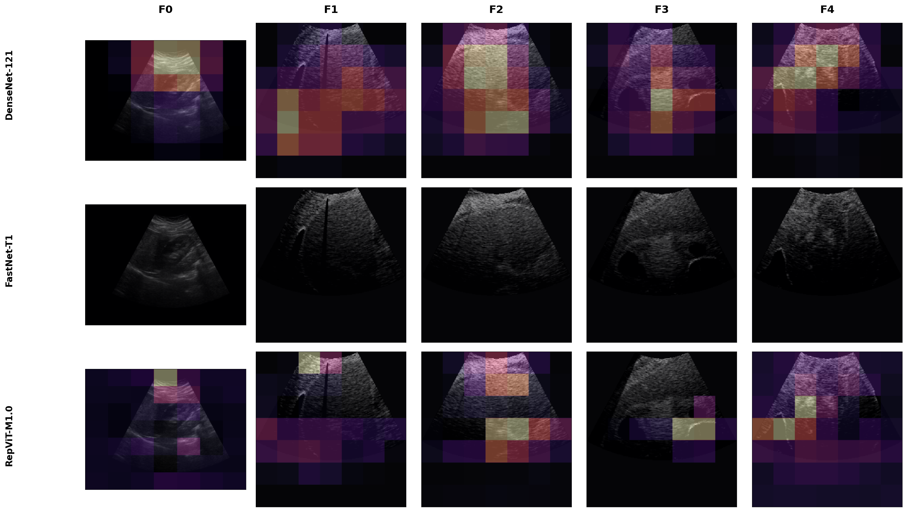

# Outline {background-color="#2c3e50"}

1. Motivation & Research Gap

2. Dataset & Benchmark Design

3. Results: the top cluster is not separable

4. Deployment Implications & Explainability

5. Limitations & Conclusion

# Background & Motivation {.smaller}

- **Liver fibrosis** progresses to cirrhosis and hepatocellular carcinoma if undetected

- Staging uses the **METAVIR scale (F0--F4)**; the **F2 boundary** often decides treatment

- **Biopsy** is accurate but invasive; **B-mode ultrasound** is accessible but hard to stage --- adjacent stages look deceptively similar

::: center
 
> **Key question:** which CNN backbone should be deployed, and on what grounds?
:::

# Research Gap & Contributions {.smaller}

::: columns
::: {.column width="48%"}

**Existing approaches:**

- Task usually collapsed to **binary** or three-class --- easier, but discards severity information

- Accuracy from a **single seed**, no stability evidence

- Ranking claimed without **statistical testing**

:::
::: {.column width="48%"}

**Our contribution:**

- Full **F0--F4**, ordinal structure preserved

- **Nine CNNs**, one identical protocol, **34 multi-seed runs**

- **Ordinal + calibration** metrics, not accuracy alone

- **Grad-CAM** check on liver texture attention

:::
:::

# Dataset & Protocol {.smaller}

::: columns
::: {.column width="52%"}

**Source:** public heterogeneous liver ultrasound release [@joo2023heterogeneous]

- **6,323** images, **955** patients, five ordinal classes

- Two hospitals, **8 scanners**, **6 manufacturers** (2009--2019)

- **Biopsy-anchored** labels, radiologist-reviewed

- Natural class imbalance kept --- it reflects clinical prevalence

:::
::: {.column width="44%"}

**Stratified split (fixed)**

| Split | $n$ |
|:------|----:|
| Train | 3,794 |
| Validation | 1,265 |
| **Test** | **1,264** |

Resize $224 \times 224$, ImageNet normalization, class-weighted sampling, minimal augmentation

:::
:::

# Benchmark & Training Setup {.smaller}

::: columns
::: {.column width="46%"}

| Band | Model | Params |
|:-----|:------|-------:|
| Heavy | ResNet-50 | 23.52 M |
| | EfficientNet-V2-S | 20.18 M |
| | DenseNet-121 | 6.96 M |
| Compact | RepViT-M1.0 | 6.41 M |
| | FastNet-T1 | 6.32 M |
| Light | MobileNetV4-Small | 2.50 M |
| | Tiny-CNN | 0.50 M |
| | Small-CNN | 0.25 M |
| | Depthwise-CNN | 0.25 M |

:::
::: {.column width="50%"}

**One recipe for all nine**

- ImageNet init; the three custom CNNs from scratch

- SGD momentum 0.9, cosine LR, batch 32, early stopping

- Seeds **41--44** $\rightarrow$ **34 valid runs**

- Test split held **fixed**, so seeds vary training, not the data

 

*A ~94$\times$ parameter spread --- how much capacity does this task need?*

:::
:::

# Evaluation Metrics {.smaller}

::: columns
::: {.column width="48%"}

**Ordinal-aware**

- **QWK** --- partial credit for near misses

- **MASE** --- mean absolute stage error

:::
::: {.column width="48%"}

**Clinical risk & trust**

- **Adjacent / severe error rate** --- off by one vs.\ off by $\geq 2$ stages

- **ECE** --- is the confidence value believable?

:::
:::

::: center
 
*Accuracy and macro-F1 alone cannot tell a one-stage miss from an F0 $\to$ F3 jump*
:::

# Aggregate Performance {.smaller background-color="#f8f9fa"}

| Model | $n$ | Acc. | Macro-F1 | QWK | Sev. Err | ECE |
|:------|:---:|:----:|:--------:|:---:|:--------:|:---:|
| **DenseNet-121** | 4 | **98.3 ± 0.3** | **97.5 ± 0.4** | **0.995** | 0.3 | 1.4 |
| FastNet-T1 | 3 | 98.2 ± 0.6 | 97.5 ± 0.9 | 0.994 | 0.3 | **0.8** |
| RepViT-M1.0 | 4 | 98.1 ± 0.3 | 97.2 ± 0.4 | 0.995 | 0.3 | **0.8** |
| EfficientNet-V2-S | 4 | 98.0 ± 0.3 | 97.2 ± 0.5 | 0.994 | **0.2** | 0.8 |
| ResNet-50 | 4 | 97.4 ± 0.5 | 96.3 ± 0.6 | 0.992 | 0.5 | 1.1 |
| MobileNetV4-Small | 3 | 93.9 ± 1.9 | 91.6 ± 2.6 | 0.970 | 2.2 | 2.1 |
| Small-CNN | 4 | 92.7 ± 1.0 | 90.0 ± 1.2 | 0.965 | 2.4 | 4.9 |
| Tiny-CNN | 4 | 83.3 ± 2.8 | 77.7 ± 3.8 | 0.907 | 6.2 | 4.9 |
| Depthwise-CNN | 4 | 82.0 ± 1.4 | 77.1 ± 1.7 | 0.877 | 7.6 | 7.0 |

::: center
*Four backbones form a top cluster near 98% --- no runaway winner*
:::

# The Top Cluster Is Not Separable {background-color="#2c3e50" .smaller}

::: columns
::: {.column width="52%"}

**Pairwise exact McNemar, paired per image**

| Model A | Model B | $p$ |
|:--------|:--------|:---:|
| DenseNet-121 | FastNet-T1 | 0.904 |
| DenseNet-121 | RepViT-M1.0 | 0.353 |
| DenseNet-121 | EfficientNet-V2-S | 0.261 |
| FastNet-T1 | RepViT-M1.0 | 0.396 |
| FastNet-T1 | EfficientNet-V2-S | 0.581 |
| RepViT-M1.0 | EfficientNet-V2-S | 0.923 |

:::
::: {.column width="44%"}

**So what decides?**

- No pair differs at $\alpha = 0.05$ --- smallest $p$ is **0.26**

- Accuracy cannot justify DenseNet over EfficientNet

- **ECE varies ~2$\times$** across the cluster: 0.8% to 1.4%

- In triage, the confidence score gates human review

:::
:::

::: center
::: {.slide-callout}
The most consequential result of this benchmark is a negative one
:::
:::

# Where the Errors Are {.smaller background-color="#f8f9fa"}

::: columns
::: {.column width="46%"}

**Confusion matrix --- DenseNet-121, 4 seeds pooled**

| True \\ Pred | F0 | F1 | F2 | F3 | F4 |
|:-------------|---:|---:|---:|---:|---:|
| **F0** | **1692** | 0 | 0 | 0 | 0 |
| **F1** | 0 | **659** | 22 | 4 | 3 |
| **F2** | 0 | 15 | **603** | 12 | 2 |
| **F3** | 0 | 5 | 12 | **660** | 11 |
| **F4** | 0 | 0 | 0 | 2 | **1354** |

:::
::: {.column width="50%"}

**Per-stage F1:** 100.0 / 96.8 / **95.0** / 96.4 / 99.3

- **74 (1.5%)** miss by one stage, only **14 (0.3%)** by two or more

- No F0 ever called fibrotic; no F4 ever called below F3

- **F2 is hardest for every backbone** --- difficulty is a property of the task

- Top cluster: ~5-point spread across stages. Tiny-CNN: **>35 points**

:::
:::

# Deployment Trade-offs {.smaller}

::: columns
::: {.column width="48%"}

**Compact backbones win on cost**

- RepViT-M1.0 and FastNet-T1: top-cluster accuracy at substantially lower FLOPs, latency, and memory than DenseNet-121

- MobileNetV4-Small: **~87% fewer FLOPs**, **2.8$\times$ faster**, for a 4-point accuracy cost

:::
::: {.column width="48%"}

**Positioning**

- Tiny custom CNNs lose up to **16 points** --- the intermediate stages are what capacity buys

- Defensible as a **triage aid**, not an autonomous diagnostic replacement

- Low-confidence and middle-stage cases hand off to a clinician

:::
:::

::: center
*Accuracy cannot separate the top cluster --- cost and calibration are the tie-breakers*
:::

# Explainable AI: Grad-CAM {.smaller}

{fig-align="center" width="66%"}

::: center

Rows: DenseNet-121, FastNet-T1, RepViT-M1.0. Columns: F0--F4.

:::

- Attention concentrates on **liver parenchyma texture**, not background, and shifts smoothly as severity increases

- Intermediate stages are the most diffuse --- matching where the confusion matrix puts the errors

# Limitations {background-color="#2c3e50" .smaller}

- **Single dataset.** No cross-center external validation yet.

- **Image-level splits.** The release carries no subject identifiers, so frames from one examination can span train and test.

- Consequently, **absolute accuracies are optimistic** relative to a patient-disjoint protocol --- especially for the extreme stages.

 

::: {.slide-callout}
What survives: identical protocol, statistical indistinguishability of the top cluster, the ~2$\times$ calibration spread, and the concentration of errors on intermediate boundaries.
:::

# Conclusion & Future Work {.smaller}

::: columns
::: {.column width="50%"}

**Conclusion**

- A **top cluster** of four backbones is **statistically indistinguishable** --- accuracy alone cannot justify a choice

- **Calibration and cost** are the defensible tie-breakers

- Errors are overwhelmingly **adjacent** (1.5%), not severe (0.3%)

:::
::: {.column width="46%"}

**Future Work**

- **Patient-disjoint external test set** --- a precondition for any absolute claim

- **Ordinal-aware losses** encoding stage ordering

- Uncertainty-aware training for safer decision support

:::
:::

# {background-color="#2c3e50" #cover}

::: center
   

::: {.closing-title}
Thank You
:::

::: {.closing-subtitle}
Questions?
:::

:::
