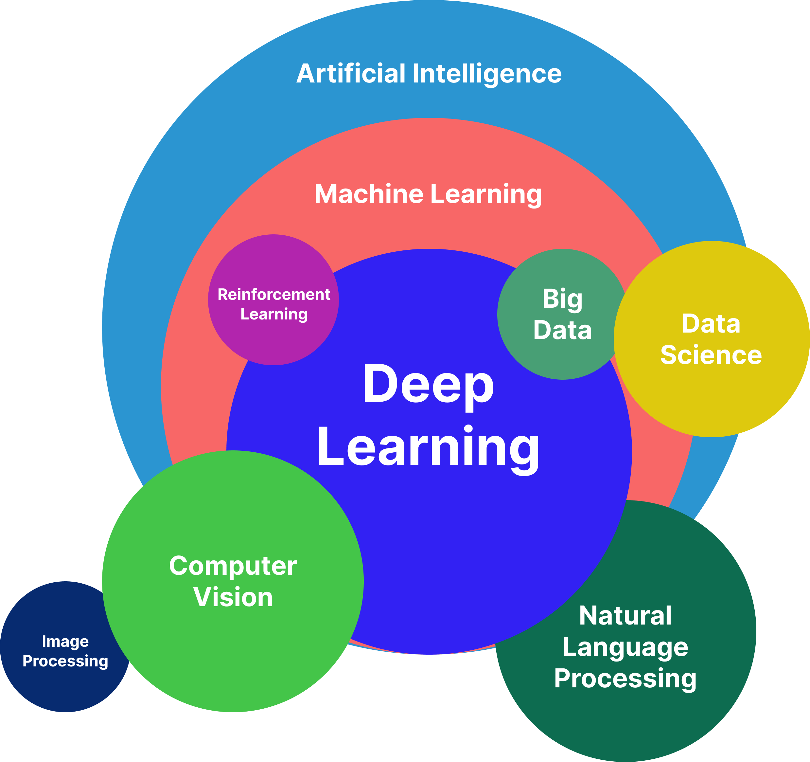
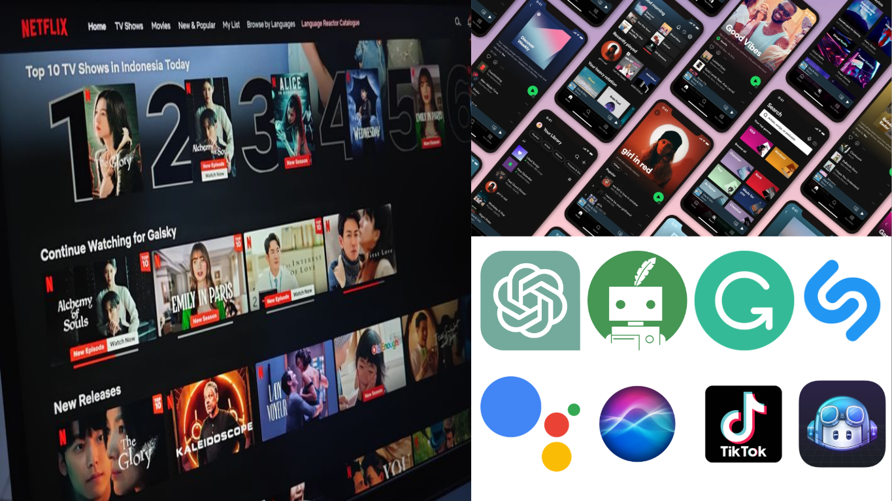
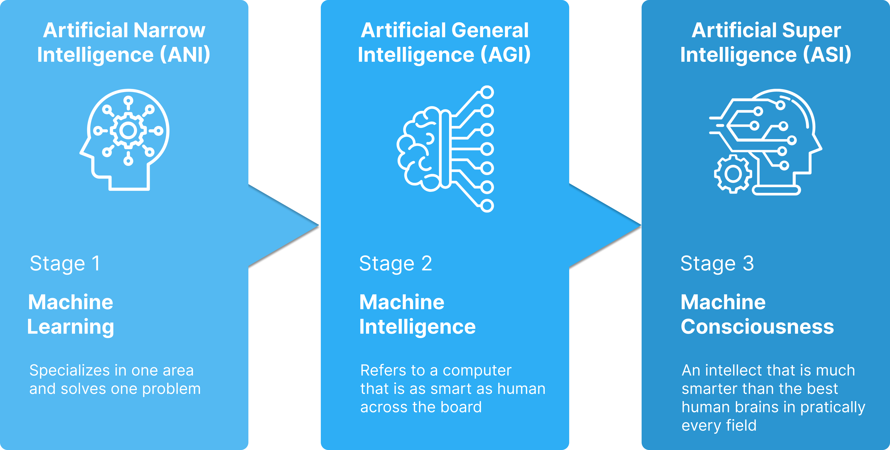

## About Me {.smaller}

:::: {.columns}
::: {.column width="30%"}

{width=200 style="border-radius: 50%; margin-bottom: 15px; display: block; margin-left: auto; margin-right: auto;"}

<div style="font-size: 0.9em; line-height: 1.8;">

**x.com**/algonacci

**github.com**/algonacci

**linkedin.com**/eric-julianto

**instagram.com**/eric.juliantooo

</div>
:::

::: {.column width="70%"}
<div style="padding-left: 30px;">

**Work Experience**

<style>
.compact-list li { margin-bottom: 0.3em; line-height: 1.2; }
.compact-list .period { font-size: 0.85em; color: #666; display: block; margin-top: -0.2em; }
</style>

<div class="compact-list">

- Research Analyst at Braincore
<span class="period">(Dec 21 - Now)</span>

- Machine Learning Mentor at Bangkit Academy
<span class="period">(Feb 23 - Jan 24)</span>

- SEO Intern at Dibilabs by Dibimbing.id
<span class="period">(Mar 23 - Jun 23)</span>

- AI Developer Intern at ZettaByte
<span class="period">(May 22 - Aug 22)</span>

</div>

**Education**

- Hospitality & Tourism at Universitas Bunda Mulia
- Computer Science at Universitas Esa Unggul

</div>
:::
::::

## Sesi Hari Ini {#sesi}

:::: {.columns}
::: {.column width="50%"}

### Sesi 1 — Teori

1. Pengenalan AI
2. Tantangan & Peluang AI
3. Jenis-jenis AI
4. AI di Kendaraan Hemat Energi

:::
::: {.column width="50%"}

### Sesi 2 — Praktik

- Bikin AI yang **mengenali objek di jalan**
- Langsung dari **Google Colab**
- Uji di **gambar** & **video**

:::
::::

::: {.callout-tip}
### Hari ini
Teori dulu untuk paham *kenapa*, lalu praktik untuk merasakan *bagaimana*.
:::

# Pengenalan AI {#sec-intro background-color="#2c3e50"}
Apa sebenarnya kecerdasan buatan itu?

## Definisi AI {#definisi}

::: {.callout-note}
### Definisi
"**Kecerdasan buatan** adalah teknologi komputer yang memungkinkan mesin melakukan tugas yang biasanya membutuhkan **kecerdasan manusia**."
:::

Contoh tugas "cerdas":

- Mengenali wajah, suara, atau objek
- Memahami bahasa manusia
- Mengambil keputusan dari data

## {#definisi-img}

{fig-align="center" width="62%"}

## Tapi, Apa Itu Kecerdasan? {#kecerdasan}

<br/>

<div style="text-align: center; font-size: 1.4em;">
"Kemampuan untuk **melakukan atau mengerjakan sesuatu**."
</div>

<br/>

::: {.callout-tip}
### Intinya
Kalau mesin bisa *mengerjakan sesuatu* yang tadinya butuh manusia — di situlah AI bekerja.
:::

## {#ai-tools-img}

{fig-align="center" width="62%"}

## Peran AI {#peran-ai}

:::: {.columns}
::: {.column width="50%"}

- Peningkatan efisiensi
- Analisis data
- Personalisasi
- Otomatisasi

:::
::: {.column width="50%"}

- Pengambilan keputusan
- Peningkatan kualitas hidup
- Mendukung kreativitas
- dan lain-lain

:::
::::

::: {.callout-note}
### Untuk mobil hemat energi
AI bisa **memantau lingkungan**, **mendeteksi objek**, dan membantu **keputusan berkendara** yang lebih aman & efisien.
:::

## AI sebagai Alat Bantu {#alat-bantu}

AI tidak menggantikan manusia — AI **memperkuat** kemampuan kita.

:::: {.columns}
::: {.column width="50%"}

### Untuk Kreativitas

- Menulis & meringkas
- Membuat ide konten
- Menerjemahkan & parafrase
- Membantu memperbaiki kode

:::
::: {.column width="50%"}

### Untuk Rekayasa

- Membaca data sensor
- Mengenali objek di jalan
- Mengoptimasi performa kendaraan
- Mendukung keputusan keselamatan

:::
::::

::: {.callout-tip}
### Tema kita
**AI sebagai alat bantu untuk meningkatkan kemampuan manusia.**
:::

# Tantangan & Peluang {#sec-challenge background-color="#2c3e50"}
Dua sisi dari pengembangan AI

## Tantangan {#tantangan .smaller}

| Tantangan | Penjelasan |
|:---|:---|
| **Etika & keamanan** | Privasi data, keamanan siber, penyalahgunaan AI |
| **Keterbatasan data** | Butuh data cukup & berkualitas untuk dilatih |
| **Kurang transparan** | Sebagian model sulit dipahami manusia |
| **Ketergantungan** | Risiko terlalu bergantung pada teknologi |

## Peluang {#peluang}

- **Multimodal AI** — satu AI menangani banyak domain (teks, gambar, suara)
- **Quantum Machine Learning** — melatih model dengan komputer kuantum
- **Artificial General Intelligence** — AI yang menyelesaikan banyak tugas umum
- **Kolaborasi teknologi** — AI + IoT, Software Engineering, Blockchain, dll

::: {.callout-tip}
### Kunci
AI bukan teknologi yang berdiri sendiri — kekuatannya muncul saat **dikolaborasikan**.
:::

# Jenis-jenis AI {#sec-types background-color="#2c3e50"}
Istilah yang sering kita dengar

## Istilah yang Sering Tertukar {#istilah .smaller}

| Istilah | Arti Singkat |
|:---|:---|
| **Artificial Intelligence** | Payung besar — kecerdasan buatan |
| **Machine Learning** | Mesin belajar dari contoh/data |
| **Deep Learning** | ML dengan neural network yang lebih mendalam |
| **Big Data** | Pengolahan data dalam jumlah sangat besar |
| **Data Science** | Ilmu mengolah & memaknai data |
| **Reinforcement Learning** | AI belajar dari coba-coba & reward |
| **Computer Vision** | AI yang mengolah data gambar |
| **Natural Language Processing** | AI yang memahami bahasa manusia |

## 3 Fase Artificial Intelligence {#tiga-fase}

| Fase | Kemampuan | Contoh |
|:---|:---|:---|
| **ANI** | Ahli pada **satu** tugas | Deteksi objek, rekomendasi, chatbot |
| **AGI** | Setara manusia di **banyak** tugas | Masih riset |
| **ASI** | Melampaui kecerdasan manusia | Masih hipotesis |

::: {.callout-note}
### Catatan
Semua AI yang ada sekarang — termasuk yang kita pakai nanti — masih **ANI**.
:::

## {#tiga-fase-img}

{fig-align="center" width="62%"}

## Tools untuk Membangun AI {#tools}

:::: {.columns}
::: {.column width="50%"}

### Bahasa & Library

- **Python** — bahasa utama AI
- TensorFlow / PyTorch
- scikit-learn
- OpenCV, **Ultralytics (YOLO)**

:::
::: {.column width="50%"}

### Platform & Alat Bantu

- **Google Colab** — GPU gratis
- Hugging Face — model siap pakai
- ChatGPT — asisten coding

:::
::::

::: {.callout-tip}
### Sesi praktik
Kita pakai **Python + Ultralytics di Google Colab**.
:::

# AI di Kendaraan Hemat Energi {#sec-vehicle background-color="#2c3e50"}
Dari konsep AI ke mobil Batavia Team

## Bagaimana Mobil Bisa "Cerdas"? {#mobil-cerdas}

:::: {.columns}
::: {.column width="48%"}

Kendaraan modern membaca lingkungannya lewat:

- 📷 **Kamera** — gambar jalan
- 📡 **Radar / Sensor** — jarak & kondisi
- ⚡ **Sensor internal** — arus, tegangan, suhu

:::
::: {.column width="52%"}

```{mermaid}
flowchart TD
    S[Sensor / Kamera / Radar] --> D[Data]
    D --> M[Model AI]
    M --> A[Keputusan]
    A -->|umpan balik| S

    style S fill:#e1f5fe
    style M fill:#fff3e0
    style A fill:#c8e6c9
```

:::
::::

::: {.callout-note}
### Alurnya
Data → Model AI → Keputusan: penghindaran tabrakan, pengenalan rambu, pemantauan lingkungan.
:::

## Computer Vision: AI yang "Melihat" {#cv}

| Tugas | Pertanyaan | Hasil |
|:---|:---|:---|
| **Klasifikasi** | "Ada apa di gambar?" | Satu label: "mobil" |
| **Deteksi Objek** | "Apa **dan** di mana?" | Kotak + label + keyakinan |
| **Segmentasi** | "Piksel ini milik apa?" | Area per piksel |

::: {.callout-tip}
### Paling berguna
Untuk kendaraan, **Deteksi Objek** — tahu *apa* dan *di mana* objeknya.
:::

# Bocoran Sesi Praktik {#sec-practice background-color="#2c3e50"}
Dua project: Tabular & Vision

## Dua Project Praktik {#dua-project .smaller}

:::: {.columns}
::: {.column width="50%"}

### 1. Tabular ML 📊

**Prediksi SoC Baterai**

Sensor (arus, tegangan, suhu) → sisa daya baterai (%)

:::
::: {.column width="50%"}

### 2. Computer Vision 🖼️

**Deteksi Objek di Jalan**

Gambar/video → kendaraan & orang

:::
::::

::: {.callout-note}
### Satu prinsip ML, dua jenis data
Angka dalam tabel **vs** piksel dalam gambar.
:::

## Project 1: Prediksi SoC Baterai {#project-soc .smaller}

**Bisakah kendaraan menebak sisa daya baterai (State of Charge) hanya dari data sensor?**

```{mermaid}
flowchart LR
    S[Sensor Baterai] --> M[Model ML] --> G[Estimasi SoC]

    style S fill:#fff3e0
    style M fill:#e1f5fe
    style G fill:#c8e6c9
```

::: {.callout-note}
### Kenapa penting
SoC = "indikator bensin" mobil listrik. Salah estimasi → salah keputusan energi.
:::

## Data Sensor Baterai {#soc-data .smaller}

| Kolom | Satuan | Arti |
|:---|:---:|:---|
| **Current** | A | Arus (charge + / discharge −) |
| **Voltage** | V | Tegangan sel |
| **Temperature** | °C | Suhu sel |
| **SoC** *(target)* | % | Sisa daya yang diprediksi |

::: {.callout-tip}
### Data latih vs uji
**Fresh cell** (358 ribu baris) → latih. **Aged cell** (307 ribu baris) → uji generalisasi.
:::

## Alur Praktik SoC {#soc-alur .smaller}

```{mermaid}
flowchart LR
    D[Baca Data Sensor] --> C[Hitung SoC - Coulomb Counting]
    C --> T[Latih Random Forest]
    T --> P[Prediksi dan Evaluasi]

    style D fill:#e1f5fe
    style C fill:#fff3e0
    style P fill:#c8e6c9
```

::: {.callout-note}
### Tabular = ML klasik
Belajar dari kolom angka — fondasi sebelum masuk ke gambar.
:::

## Project 2: Deteksi Objek di Jalan {#project}

Sebuah AI yang melihat foto/video jalan dan menandai:

:::: {.columns}
::: {.column width="50%"}

- 🚗 Mobil (car)
- 🚚 Truk (truck)
- 🚌 Bus (bus)
- 🚲 Sepeda (bike)

:::
::: {.column width="50%"}

- 🏍️ Motor (motor)
- 🧍 Pengendara (rider)
- 🚶 Orang (person)

:::
::::

::: {.callout-tip}
### Kenapa penting
Inilah dasar fitur seperti **penghindaran tabrakan** pada kendaraan cerdas.
:::

## Alur Praktik Deteksi Objek {#alur}

```{mermaid}
flowchart LR
    D[Siapkan Dataset] --> T[Latih Model di Colab]
    T --> I[Uji di Gambar]
    I --> V[Uji di Video]

    style D fill:#e1f5fe
    style T fill:#fff3e0
    style V fill:#c8e6c9
```

::: {.callout-note}
### Tenang
Detailnya kita kerjakan **langsung dari Colab** di sesi praktik — tinggal jalankan sel per sel.
:::

## Dari Deteksi ke Keputusan {#keputusan}

:::: {.columns}
::: {.column width="48%"}

### Hasil Deteksi

```
🚶 orang × 3   (0.90)
🚗 mobil × 2   (0.85)
🏍️ motor × 1   (0.78)
```

:::
::: {.column .arrow-column .arrow-column-medium width="4%"}
→
:::
::: {.column width="48%"}

### Kemungkinan Keputusan

- 🛑 Ada orang → kurangi kecepatan
- 🚗 Mobil dekat → jaga jarak
- 🏍️ Motor menyalip → waspada

:::
::::

::: {.callout-important}
### Ingat
AI memberi **persepsi** (apa & di mana). Keputusan berkendara diambil sistem terpisah.
:::

## Penutup {#penutup}

:::: {.columns}
::: {.column width="48%"}

### Tiga Pertanyaan Kunci

> **1.** Data apa yang bisa saya kumpulkan?

> **2.** Apa yang ingin diprediksi model?

> **3.** Keputusan apa yang akan memakainya?

:::
::: {.column width="52%"}

```{mermaid}
flowchart TD
    Q1[Data apa?] --> Q2[Prediksi apa?]
    Q2 --> Q3[Keputusan apa?]
    Q3 --> S[Sistem yang berguna]

    style Q1 fill:#e1f5fe
    style Q2 fill:#fff3e0
    style Q3 fill:#c8e6c9
    style S fill:#ede7f6
```

:::
::::

::: {.callout-tip}
### Takeaway
Project AI yang baik dimulai dari **keputusan nyata**, bukan dari nama model.
:::

<div style="text-align: center;">

## Q&A {#qa}

### Terima kasih! Lanjut ke sesi praktik 🚀

</div>
