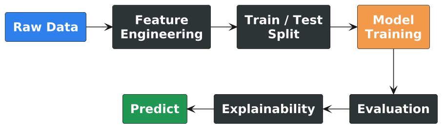
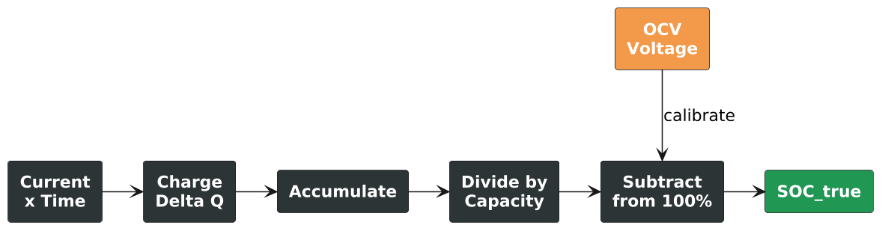

## Machine Learning for Intelligent Vehicles {background-color="#2c3e50"}

<br/>

**IGNITE Batavia Team × Universitas Negeri Jakarta**

<br/>

<div style="font-size: 0.8em; color: #aaa;">
Today is not about becoming ML experts — it's about direct, first-hand experience with ML workflows.
</div>

---

## Why Are Vehicles Becoming Intelligent? {.smaller .fit-slide background-color="#1a1a2e"}

:::: {.columns}
::: {.column width="50%"}

- **Roads are dynamic** — unpredictable environment
- **Energy is limited** — battery must be managed
- **Safety decisions are fast** — milliseconds matter
- **Sensors generate huge data** — too much for manual rules

:::
::: {.column width="50%"}

```{mermaid}
flowchart TD
    S[Sensors] --> D[Data Stream]
    D --> M[ML Models]
    M --> A[Action]
    A -->|feedback| S

    style S fill:#2f80ed,color:#fff
    style M fill:#f2994a,color:#fff
    style A fill:#219653,color:#fff
```

:::
::::

::: footer
Intelligence is a practical engineering need — not a luxury feature.
:::

---

## Workshop Journey {.smaller .fit-slide background-color="#1a1a2e"}

:::: {.columns}
::: {.column .center-column width="50%"}

### Inside the Vehicle

⚡ **Battery Sensors** → 📊 **SoC Estimation**

<br/>

Current, Voltage, Temperature → State of Charge

:::
::: {.column .center-column width="50%"}

### Outside the Vehicle

📷 **Camera Image** → 🎯 **Object Detection**

<br/>

Pixels → Cars, People, Traffic Lights

:::
::::

<br/>

::: {.callout-tip}
Two different data types — one unified ML workflow.
:::

---

## What Is Machine Learning? {.smaller .fit-slide}

:::: {.columns}
::: {.column width="45%"}

### Traditional Programming

```{mermaid}
flowchart LR
    R[Rules] --> P{Program}
    D[Data] --> P
    P --> A[Answer]

    style R fill:#eb5757,color:#fff
```

<div style="text-align: center;">
You write the logic
</div>

:::
::: {.column .arrow-column .arrow-column-tall width="10%"}

**→**

:::
::: {.column width="45%"}

### Machine Learning

```{mermaid}
flowchart LR
    D[Data] --> M{Model}
    A[Examples] --> M
    M --> P[Pattern]

    style M fill:#2f80ed,color:#fff
    style P fill:#219653,color:#fff
```

<div style="text-align: center;">
Model learns from examples
</div>

:::
::::

::: {.callout-tip icon=false}
Instead of writing every battery rule manually, show the model examples of "sensor readings → known SoC" and let it learn.
:::

---

## The Four Words We Need {.smaller}

| Word | Simple Meaning | Vehicle Example |
|:---|:---|:---|
| **Feature** | Input data the model reads | Current, Voltage, Temperature |
| **Target** | What we want to predict | State of Charge (0–100%) |
| **Training** | Learning from examples | Fresh battery data + known SoC |
| **Prediction** | Model output on new data | Estimated SoC from sensors |

::: {.callout-tip icon=false}
Four words. That's enough vocabulary for the entire workshop.
:::

---

## Supervised Learning — Intuition {.smaller .fit-slide}

:::: {.columns}
::: {.column width="48%"}

### Training Phase

| Current | Voltage | Temp | **SoC?** |
|:---:|:---:|:---:|:---:|
| 2.36 | 2.99 | 27.4 | **100%** |
| −19.8 | 3.75 | 26.1 | **56%** |
| 20.1 | 3.92 | 26.8 | **78%** |

<div style="font-size: 0.8em; color: #888;">
Model sees: sensors + answer → learns mapping
</div>

:::
::: {.column .arrow-column .arrow-column-x-tall width="4%"}
→
:::
::: {.column width="48%"}

### Prediction Phase

| Current | Voltage | Temp | **SoC?** |
|:---:|:---:|:---:|:---:|
| −4.3 | 3.68 | 26.5 | **??** |
| 15.7 | 4.05 | 27.1 | **??** |

<div style="font-size: 0.8em; color: #888;">
Model sees: sensors only → estimates answer
</div>

:::
::::

::: {.callout-note icon=false}
Like studying with answer keys, then taking the exam.
:::

---

## ML Workflow {.smaller}

{width=55%}

::: {.callout-tip icon=false}
Presentation = the **why**. Notebook = the **how**.
:::

---

## Part 1: Battery State of Charge {.smaller background-color="#1a1a2e"}

**Can a vehicle estimate battery SoC from sensor data?**

```{mermaid}
flowchart LR
    S[⚡ Sensors] --> M[🤖 ML Model] --> G[📊 SoC Gauge]

    style S fill:#f2994a,color:#fff
    style M fill:#2f80ed,color:#fff
    style G fill:#219653,color:#fff
```

---

## Why SoC Matters {.smaller .fit-slide}

:::: {.columns}
::: {.column width="50%"}

### If SoC is Wrong

- ❌ Overestimate range → stranded
- ❌ Inefficient charging → wasted energy
- ❌ Battery degradation → shorter lifespan
- ❌ Poor energy decisions → safety risk

::: {.callout-important}
5% SoC error on 300 km range = **15 km of uncertainty.**
:::

:::
::: {.column width="50%"}

```{mermaid}
flowchart TD
    SOC[Accurate SoC] --> R[✅ Reliable Range]
    SOC --> E[✅ Efficient Charging]
    SOC --> B[✅ Battery Safety]
    SOC --> M[✅ Smart Energy Mgmt]

    style SOC fill:#2f80ed,color:#fff
```

:::
::::

---

## Our Sensor Data {.smaller}

| Column | Unit | Meaning | Range |
|:---|:---:|:---|:---|
| **Time** | s | Elapsed time | 0 → 307,513 (~85h) |
| **Current** | A | Charging (+) / Discharging (−) | −20 to +33 |
| **Voltage** | V | Terminal voltage | 3.0 → 4.2 |
| **Temperature** | °C | Cell temperature | 25 → 28 |

::: {.callout-note icon=false}
**Fresh battery** (358K rows) → training. **Aged battery** (307K rows) → testing.  
Plus OCV-SOC lookup table (1001 points) for calibration.
:::

---

## Coulomb Counting — How We Get the Target {.smaller .fit-slide}

<div style="text-align: center;">

$$SOC(t) = SOC(0) - \frac{1}{C_{nom}} \int_{0}^{t} I(\tau) \, d\tau$$

</div>

:::: {.columns}
::: {.column width="50%"}

1. Measure current every second
2. Current × time → charge (Ah)
3. Subtract from full capacity
4. Calibrate with OCV when current ≈ 0

<div style="font-size: 0.8em; color: #888;">
Notebook: `compute_soc()` and `compute_capacity()`
</div>

:::
::: {.column width="50%"}



:::
::::

---

## Feature Engineering {.smaller}

### From Raw Sensors to ML Features

| Feature | Source | Why It Helps |
|:---|:---|:---|
| **Current** | Raw | Charge/discharge direction and rate |
| **Voltage** | Raw | Strong correlation with SoC (OCV curve) |
| **Temperature** | Raw | Affects battery behavior |
| **cum_charge** | Engineered | Cumulative history — model sees past, not just instant |

::: {.callout-note}
`cum_charge` is computed by integrating current over time. The raw data didn't have it — we created it.
:::

---

## Train / Test Split {.smaller .fit-slide}

:::: {.columns}
::: {.column .center-column width="48%"}

### Training

🪫 **Fresh Battery Cell**

358K rows — brand new behavior

Model learns the "ideal" mapping

:::
::: {.column .arrow-column .arrow-column-tall width="4%"}
→
:::
::: {.column .center-column width="48%"}

### Testing

🔋 **Aged Battery Cell**

307K rows — degraded behavior

Does the model generalize?

:::
::::

::: {.callout-important}
A model trained on fresh cells may fail on aged cells. **This is why testing matters.**
:::

---

## Random Forest — How It Works {.smaller .fit-slide}

:::: {.columns}
::: {.column width="48%"}

- Many decision trees vote together
- Each tree sees random subset of data & features
- Average of all trees → final prediction

<br/>

::: {.callout-tip icon=false}
Like asking 100 mechanics to estimate battery health, then averaging.
:::

:::
::: {.column width="52%"}

```{mermaid}
flowchart TD
    D[Input Features] --> T1[Tree 1]
    D --> T2[Tree 2]
    D --> T3[...]
    D --> T4[Tree N]
    T1 --> V[Majority Vote]
    T2 --> V
    T3 --> V
    T4 --> V
    V --> P[SoC Prediction]

    style D fill:#2f80ed,color:#fff
    style V fill:#f2994a,color:#fff
    style P fill:#219653,color:#fff
```

:::
::::

---

## Random Forest — Why It Works {.smaller}

- Handles **nonlinear** Voltage-SoC relationship
- Robust to noisy sensor readings
- Easy to interpret (feature importance)
- Good baseline for tabular data

<br/>

### Notebook snippet

```python
rf = RandomForestRegressor(
    n_estimators=100, max_depth=15, random_state=42
)
rf.fit(X_train, y_train)
```

Training time: ~2 minutes | Results: MAE 0.10, RMSE 0.18, R² 0.42

---

## XGBoost — How It Works {.smaller .fit-slide}

:::: {.columns}
::: {.column width="48%"}

- Builds trees **sequentially**, not parallel
- Each new tree fixes previous trees' mistakes
- Gradient boosting: minimize error step by step

<br/>

::: {.callout-tip icon=false}
Like a student who reviews wrong answers and focuses on those areas.
:::

:::
::: {.column width="52%"}

```{mermaid}
flowchart LR
    M1[Model 1] -->|errors| M2[Model 2]
    M2 -->|errors| M3[Model 3]
    M3 -->|errors| MN[...]
    MN -->|sum| P[Final Prediction]

    style M1 fill:#eb5757,color:#fff
    style M2 fill:#f2994a,color:#fff
    style M3 fill:#f2c94c,color:#000
    style P fill:#219653,color:#fff
```

:::
::::

---

## XGBoost — Why It's Stronger {.smaller}

- **Gradient boosting** — each step reduces remaining error
- Often beats Random Forest on tabular data
- Built-in regularization prevents overfitting
- Industry favorite for competitions

<br/>

### Notebook snippet

```python
xgb = XGBRegressor(
    n_estimators=300, max_depth=10, learning_rate=0.05
)
xgb.fit(X_train, y_train)
```

Training time: ~10 sec | Results: MAE 0.10, RMSE 0.17, R² 0.50

---

## RF vs XGBoost {.smaller}

| Aspect | Random Forest | XGBoost |
|:---|:---|:---|
| Tree building | Parallel (independent) | Sequential (fixes errors) |
| Training speed | ~2 min | ~10 sec |
| Overfitting risk | Low (averaging) | Moderate (needs tuning) |
| R² (accuracy) | 0.42 | **0.50** |
| Best for | Quick baselines | When accuracy matters |

::: {.callout-important}
R² ≈ 0.5 means room for improvement — what other features could help?
:::

---

## How to Read the Results {.smaller}

| Metric | Meaning | Good Value | What It Tells You |
|:---|:---|:---:|:---|
| **MAE** | Average absolute error | < 0.05 | "On average, how far off?" |
| **RMSE** | Penalizes large errors | < 0.10 | "How bad are the worst predictions?" |
| **R²** | Variance explained | > 0.8 | "What fraction did the model capture?" |

::: {.callout-tip}
MAE = 0.10 → model is off by 10% SoC on average.  
For 300 km range, that's **30 km of uncertainty.**
:::

---

## SHAP — How Models Explain Themselves {.smaller}

### Asking: "What Were You Looking At?"

SHAP tells us which features pushed each prediction up or down.

```{mermaid}
flowchart LR
    F1[Voltage: +0.3] --> P
    F2[Current: −0.1] --> P
    F3[Temperature: +0.02] --> P
    P[Final Prediction = Base + Sum of SHAP]

    style F1 fill:#2f80ed,color:#fff
    style F2 fill:#eb5757,color:#fff
    style F3 fill:#f2c94c,color:#000
    style P fill:#219653,color:#fff
```

Notebook: `shap.TreeExplainer(rf).shap_values()` + `summary_plot()`

---

## Why Model Interpretation Matters {.smaller}

| Question | Engineering Implication |
|:---|:---|
| **Debugging** | Is the model ignoring an important sensor? |
| **Trust** | Does it rely on physics (voltage) or noise? |
| **Regulation** | Can we explain decisions to auditors? |
| **Feature selection** | Which sensors can we remove to save cost? |

::: {.callout-important}
In safety-critical systems, **knowing why** is as important as knowing the output.
:::

---

## Part 2: Object Detection {.smaller .fit-slide background-color="#1a1a2e"}

### From Sensor Tables to Road Cameras

:::: {.columns}
::: {.column .center-column width="45%"}

📊 **Inside: Numbers in a Table**

Current, Voltage, Temp → SoC

:::
::: {.column .arrow-column width="10%"}
→
:::
::: {.column .center-column width="45%"}

🖼️ **Outside: Pixels in an Image**

Camera feed → Objects in the scene

:::
::::

::: {.callout-note icon=false}
Same ML principle. Different data structure.  
Tabular ML reads columns. CV reads spatial patterns.
:::

---

## Why Computer Vision for Vehicles? {.smaller .fit-slide}

:::: {.columns}
::: {.column width="45%"}

A vehicle must **perceive** its environment:

- 🚶 People — pedestrians, cyclists
- 🚗 Vehicles — cars, motorcycles, buses
- 🚦 Traffic elements — lights, signs
- 🛑 Obstacles — barriers, debris

:::
::: {.column width="55%"}

```{mermaid}
flowchart TD
    C[📷 Camera] --> D[Object Detection]
    D --> F[🚶 Person]
    D --> G[🚗 Car]
    D --> H[🚦 Traffic Light]
    F & G & H --> P[🧠 Planning]
    P --> A[Decision: Slow down]

    style C fill:#2f80ed,color:#fff
    style P fill:#f2994a,color:#fff
    style A fill:#219653,color:#fff
```

:::
::::

---

## Three Computer Vision Tasks {.smaller}

| Task | Question | Output |
|:---|:---|:---|
| **Classification** | "What is in the image?" | Single label: "car" |
| **Object Detection** | "What and where?" | Boxes + labels + confidence |
| **Segmentation** | "Which pixel belongs to what?" | Pixel-level masks |

<br/>

```{mermaid}
flowchart LR
    I[Input Image] --> C["Classification\nCar"]
    I --> D["Detection\nCar at x,y,w,h"]
    I --> S["Segmentation\nEvery pixel"]

    style C fill:#2f80ed,color:#fff
    style D fill:#219653,color:#fff
    style S fill:#9b51e0,color:#fff
```

---

## Object Detection Output {.smaller}

### For Each Detected Object

| Field | Example | Meaning |
|:---|:---|:---|
| **Class name** | `car` | What the object is |
| **Bounding box** | (x1, y1, x2, y2) | Where in the image |
| **Confidence** | 0.85 | How sure (0 to 1) |

::: {.callout-important}
Confidence ≠ accuracy. High confidence doesn't guarantee correctness — always inspect results.
:::

---

## Meet YOLOv8 {.smaller .fit-slide}

### **Y**ou **O**nly **L**ook **O**nce

:::: {.columns}
::: {.column width="45%"}

- **Single pass** — one forward pass for all objects
- **Real-time** — fast enough for video
- **Pretrained** — 80 COCO classes out of the box
- **YOLOv8n** — nano version, ideal for workshops

::: {.callout-note}
Today: **inference only.** Training from scratch takes days on server GPUs.
:::

:::
::: {.column width="55%"}

| Variant | Size | Speed | Use Case |
|:---|:---|:---|:---|
| YOLOv8n | Nano | Fastest | Edge devices |
| YOLOv8s | Small | Fast | Lightweight apps |
| YOLOv8m | Medium | Balanced | General purpose |
| YOLOv8x | X-Large | Slowest | Max accuracy |

:::
::::

---

## Why Pretrained Models? {.smaller .fit-slide}

:::: {.columns}
::: {.column width="48%"}

### ✅ Advantages

- Ready to use immediately
- Trained on millions of images
- No GPU training needed
- Good for demos & prototypes

<br/>

### ⚠️ Limitations

- May miss specialized objects
- Trained on general scenes
- Accuracy depends on domain similarity

:::
::: {.column width="52%"}

```{mermaid}
flowchart TD
    subgraph PT["Pretraining (YOLO team)"]
        A[COCO Dataset\n330K images] --> B[Train YOLO\nserver GPUs]
        B --> C[yolov8n.pt]
    end
    subgraph INF["Inference (Workshop)"]
        D[Road Image] --> C
        C --> E[Detections]
    end

    style PT fill:#1a1a2e,color:#fff
    style INF fill:#2d3436,color:#fff
    style C fill:#f2994a,color:#fff
```

:::
::::

---

## YOLO Practical Pipeline {.smaller}

```{mermaid}
flowchart LR
    S1[1. Install] --> S2[2. Import]
    S2 --> S3[3. Download image]
    S3 --> S4[4. Load model]
    S4 --> S5[5. Run inference]
    S5 --> S6[6. Visualize boxes]
    S6 --> S7[7. Table output]
    S7 --> S8[8. Filter objects]
    S8 --> S9[9. Count]

    style S5 fill:#f2994a,color:#fff
    style S6 fill:#2f80ed,color:#fff
    style S9 fill:#219653,color:#fff
```

::: {.callout-tip icon=false}
Notebook: `yolo_object_detection_workshop.ipynb` — each step is a separate cell.
:::

---

## Objects We Care About {.smaller .fit-slide}

### Road-Relevant Classes

:::: {.columns}
::: {.column width="48%"}

| Class | Relevance |
|:---|:---|
| 🚶 Person | Safety-critical |
| 🚗 Car | Most common |
| 🏍️ Motorcycle | Common in Indonesia |
| 🚌 Bus | Different behavior |
| 🚛 Truck | Long braking |
| 🚦 Traffic Light | Signal compliance |

:::
::: {.column width="52%"}

### Why Filter?

YOLO detects 80 classes — we need only 6.

Classes we **ignore**: 🍕 Pizza, 🛋️ Couch...

<br/>

```python
road_classes = [
    "person", "car", "motorcycle",
    "bus", "truck", "traffic light"
]
```

<br/>

In production, filtering reduces noise and improves safety.

:::
::::

---

## From Detection to Decision {.smaller .fit-slide}

YOLO detects objects — but who makes the decision?

:::: {.columns}
::: {.column width="48%"}

### Detection Output

```
🚶 person × 3  (conf: 0.9)
🚗 car × 2     (conf: 0.85)
🚦 light × 1   (conf: 0.78)
```

:::
::: {.column .arrow-column .arrow-column-medium width="4%"}
→
:::
::: {.column width="48%"}

### Possible Decisions

- 🛑 **Person ahead** → reduce speed
- 🚗 **Cars nearby** → keep distance
- 🚦 **Red light** → prepare to stop

:::
::::

::: {.callout-important}
YOLO provides **perception**, not driving. A separate planning module makes decisions.
:::

---

## Practical Challenges {.smaller .fit-slide}

### What to Try After the Walkthrough

:::: {.columns}
::: {.column width="48%"}

### Part 1: Battery SoC

- Complete the Linear Regression challenge
- Experiment with Genetic Algorithm (cell 44-47)
- Change hyperparameters manually
- Discuss: why is R² below 0.5?

:::
::: {.column width="48%"}

### Part 2: YOLOv8

- Upload your own road image
- Adjust confidence threshold (0.10 vs 0.60)
- Count only vehicle classes
- Compare crowded vs empty road

:::
::::

---

## Intelligent Vehicle System {.smaller .fit-slide}

```{mermaid}
flowchart TD
    subgraph S["🔌 Sensors"]
        BMS[Battery\nCurrent, Voltage, Temp]
        CAM[Camera\nRoad Scene]
    end
    subgraph P["🔍 ML Perception"]
        SOC[SoC Estimator]
        DET[Object Detector]
    end
    subgraph D["🧠 Decision"]
        ENERGY[Energy Manager]
        SAFETY[Safety Monitor]
    end

    BMS --> SOC --> ENERGY
    CAM --> DET --> SAFETY

    style S fill:#1a1a2e,color:#fff
    style P fill:#2d3436,color:#fff
    style D fill:#1a1a2e,color:#fff
```

SoC estimation and object detection are two perception blocks in a larger intelligence system.

---

## Closing Reflection {.smaller .fit-slide}

:::: {.columns}
::: {.column width="48%"}

### Three Questions

> **1.** What data can I collect?

> **2.** What should the model predict?

> **3.** What decision will use it?

:::
::: {.column width="52%"}

```{mermaid}
flowchart TD
    Q1[What data?] --> Q2[What to predict?]
    Q2 --> Q3[What decision?]
    Q3 --> S[A useful system]

    style Q1 fill:#2f80ed,color:#fff
    style Q2 fill:#f2994a,color:#fff
    style Q3 fill:#219653,color:#fff
    style S fill:#9b51e0,color:#fff
```

:::
::::

::: {.callout-tip icon=false}
A useful ML project starts from a real decision, not a model name.
:::

---

## References

::: {#refs}
:::

---

## Q&A {background-color="#2c3e50"}

<br/>

### Thank you for listening

<br/>

<div style="font-size: 0.7em; color: #aaa;">
IGNITE Batavia Team × Universitas Negeri Jakarta<br/>
Exploring the Potential of Intelligent Technologies
</div>
