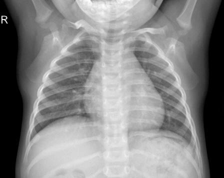
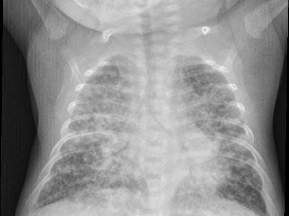
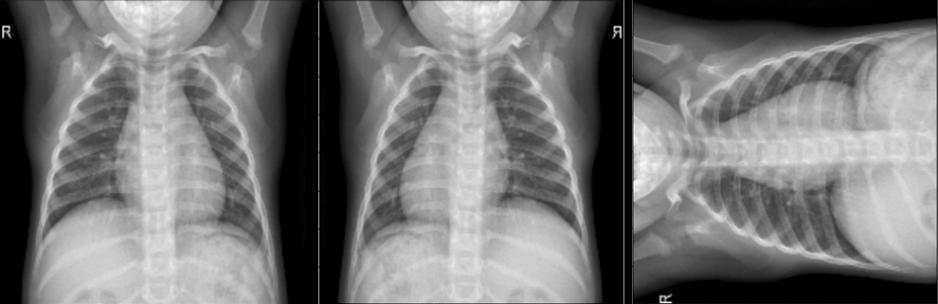
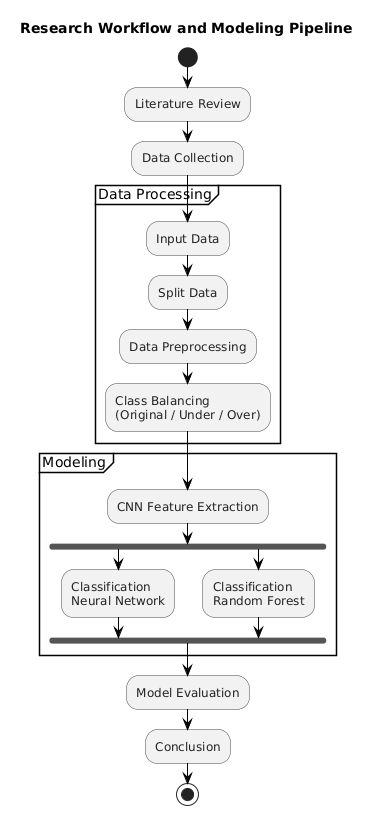
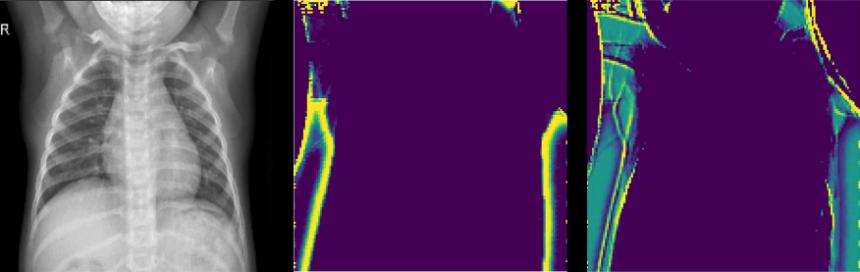
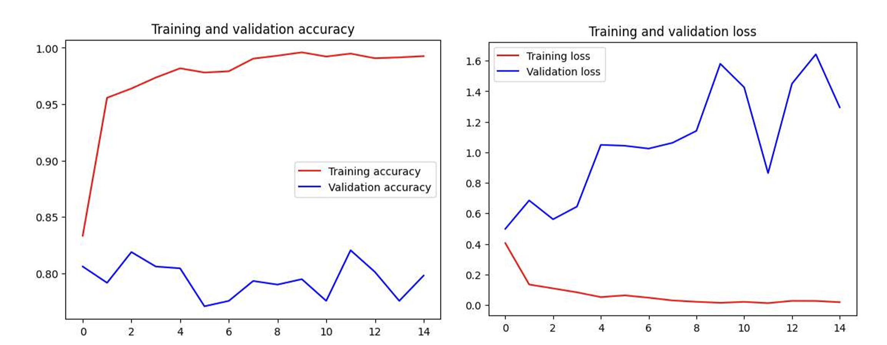

# Outline {background-color="#051892"}

1. Background & Motivation

2. Research Gap

3. Dataset & Methodology

4. Experimental Setup

5. Results & Discussion

6. Conclusion & Future Work

# Background & Motivation {.smaller}

- **Pneumonia** — leading cause of child mortality under five in developing regions [@lim2021pneumonia, @unicef2019pneumonia]

- Chest X-ray is the most accessible screening modality, but manual interpretation suffers from **inter-observer variability** [@kundu2021pneumonia]

- CNN-based methods show strong performance but require **high computational cost** and are sensitive to **class imbalance** [@yamashita2021cnn, @ravi2017health]

::: center
 
> **Key question:** Can we maintain CNN's representation quality while drastically reducing training cost?
:::

# Research Gap {.smaller}

::: columns
::: {.column width="48%"}

**Existing approaches:**

- Pure deep models → high accuracy, high cost

- Limited efficiency analysis across balancing strategies

- Hybrid CNN--RF evidence lacks cross-setting evaluation

:::
::: {.column width="48%"}

**Our contribution:**

- Direct comparison: Baseline CNN vs.\ Hybrid CNN--RF

- Three balancing settings evaluated

- Joint **performance + efficiency + calibration** analysis

:::
:::

# Proposed Approach {.smaller}

::: center
 

Two pipelines share the **same CNN feature extractor**:

 

::: columns
::: {.column width="44%"}
**Baseline CNN (DL-Based)**

CNN → DNN head
:::
::: {.column width="44%"}
**Hybrid CNN (RF)**

CNN → RF classifier
:::
:::

 

**Core idea:** decouple feature extraction from classification

:::

# Dataset {.smaller}

::: columns
::: {.column width="46%"}

**Source:** Kaggle pediatric chest X-ray

- 5,840 images total

- 5,216 train / 624 val

- Binary: Normal vs.\ Pneumonia

- Input: $200 \times 200$ RGB

- Binary target: Class 0 Normal, Class 1 Pneumonia

:::
::: {.column width="50%"}

{.xray-pair}
{.xray-pair}

::: {.figure-caption}
Representative pediatric chest X-ray samples for each class
:::

:::
:::

# Class Balancing Settings {.smaller}

Three training settings are compared throughout:

1. **Original** — preserves the natural class imbalance

2. **Undersampled** — reduces majority-class instances

3. **Oversampled** — augments minority-class images with geometric transforms

::: center
 

Each setting is evaluated on **both** pipelines, so the comparison isolates
the effect of the classifier from the effect of balancing.

:::

# Data Augmentation {.smaller}

::: center

{.figure-wide}

::: {.figure-caption}
Geometric transforms — flipping and rotation — used to augment
minority-class images in the oversampled setting
:::

:::

# Research Workflow {.smaller}

::: columns
::: {.column width="42%"}

{.figure-tall}

:::
::: {.column width="54%"}

 

**Data processing**

- Split → preprocess → class balancing

**Modeling**

- Shared CNN feature extraction

- Two heads: DNN vs.\ Random Forest

**Evaluation**

- Same features, same protocol — only the classifier differs

:::
:::

# Proposed Methodology: Feature Extractor {.smaller}

::: columns
::: {.column width="46%"}

**CNN Feature Extractor (shared)**

| Block | Filters | Kernel | Act. |
|:-----:|:-------:|:------:|:----:|
| 1 | 32 | $3 \times 3$ | ReLU |
| 2 | 64 | $3 \times 3$ | ReLU |
| 3 | 128 | $3 \times 3$ | ReLU |

→ Pooling → Flatten → Feature vector

:::
::: {.column width="50%"}

{.figure-wide}

::: {.figure-caption}
Example intermediate feature maps from the CNN backbone
:::

:::
:::

::: center

**Shared representation** extracted once, then passed to different classifiers

:::

# Proposed Methodology: Classification Heads {.smaller}

::: columns
::: {.column width="48%"}
**Baseline: DNN Head**

- 1 hidden layer (126 neurons)

- 2-neuron softmax output

- Adam, lr = 0.001, 15 epochs
:::
::: {.column width="48%"}
**Hybrid: Random Forest**

- 50 trees, seed = 42

- Split: Entropy / Gini

- Feature sampling: $\sqrt{d}$
:::
:::

# Experimental Setup {.smaller}

::: columns
::: {.column width="55%"}

**Evaluation metrics:**

- Accuracy, Macro Recall/Precision/F1

- ROC-AUC

- Brier Score, ECE

- Sensitivity at fixed Specificity

:::
::: {.column width="40%"}

**Protocol:**

- 5 independent runs (different seeds)

- McNemar's test ($p < 0.05$)

- Google Colab Pro (T4 GPU, High-RAM runtime)

:::
:::

# Results: Performance Comparison {.smaller background-color="#F8FBFF"}

| Dataset | Model | Acc. | F1 | AUC |
|:-------:|:-----:|:----:|:--:|:---:|
| Original | Baseline CNN | 73% | 64% | 0.91 |
| Original | **Hybrid (RF-Gini)** | **75%** | **68%** | **0.93** |
| Undersampled | Baseline CNN | 80% | 75% | 0.95 |
| Undersampled | **Hybrid (RF-Gini)** | **86%** | **84%** | **0.96** |
| Oversampled | Baseline CNN | 74% | 65% | 0.91 |
| Oversampled | **Hybrid (RF-Gini)** | **77%** | **72%** | **0.92** |

::: center
*Best configuration: Hybrid CNN (RF-Gini) on undersampled data*
:::

# Results: Key Takeaways {.smaller background-color="#F8FBFF"}

::: columns
::: {.column width="48%"}
**Accuracy trend**

- Hybrid beats baseline in all three balancing settings

- Largest gain appears on **undersampled** data

- AUC remains consistently high across settings
:::
::: {.column width="48%"}
**Main interpretation**

- Better feature reuse with a simpler classifier

- Stronger robustness under class imbalance

- Best trade-off comes from undersampling + RF-Gini
:::
:::

# Results: Computational Efficiency {.smaller background-color="#F8FBFF"}

| Dataset | Baseline CNN | Hybrid (Gini) | Speedup |
|:-------:|:-----------:|:-------------:|:-------:|
| Original (5216) | 47 min | 2 min | 24.6× |
| Undersampled (2682) | 23 min | **48 sec** | **30.1×** |
| Oversampled (7750) | 73 min | 3 min 20 sec | 24.2× |

::: center
 

::: {.slide-callout}
Up to **30× faster training** with improved metrics
:::
:::

# Results: Overfitting Analysis {.smaller}

::: columns
::: {.column width="55%"}

**Baseline CNN train/val loss:**

| Setting | Tr.\ (E5) | Val.\ (E5) | Tr.\ (E15) | Val.\ (E15) |
|:-------:|:---------:|:----------:|:----------:|:-----------:|
| Original | 0.312 | 0.728 | 0.021 | 0.704 |
| Undersamp. | 0.284 | 0.543 | 0.012 | 0.531 |
| Oversamp. | 0.296 | 0.754 | 0.017 | 0.783 |

:::
::: {.column width="40%"}

**Observation:**

- Training loss → 0

- Validation loss **increases** → overfitting

- Worst in oversampled setting

:::
:::

 

→ **Hybrid avoids this:** RF fitted on fixed features, no gradient updates

# Overfitting: Learning Curves {.smaller}

::: center

{.figure-wide}

::: {.figure-caption}
Baseline CNN, undersampled setting — training accuracy saturates near 1.0
while validation accuracy plateaus, and validation loss climbs after mid-training
:::

:::

# Results: Statistical Reliability {.smaller background-color="#F8FBFF"}

::: columns
::: {.column width="55%"}

**Multi-run stability (5 runs):**

| Model | Accuracy | F1 | Specificity |
|:-----:|:--------:|:--:|:-----------:|
| Baseline | 79.4 ± 1.1 | 73.8 ± 1.5 | 83.2 ± 1.3 |
| **Hybrid** | **85.2 ± 0.8** | **83.1 ± 1.2** | **89.4 ± 1.1** |

:::
::: {.column width="40%"}

**McNemar's test:**

- Original: $p = 0.018$

- Undersampled: $p = 0.003$

- Oversampled: $p = 0.009$

:::
:::

::: center
*All $p < 0.05$ — statistically significant*
:::

# Results: Calibration & Clinical Metrics {.smaller background-color="#F8FBFF"}

| Model | Brier | ECE (\%) | Sens.\ at 80\% Spec. | Sens.\ at 90\% Spec. | Sens.\ at 95\% Spec. |
|:-----:|:-----:|:--------:|:-----------------:|:-----------------:|:-----------------:|
| Baseline CNN | 0.152 | 8.7 | 82 | 76 | 65 |
| **Hybrid (RF-Gini)** | **0.118** | **6.3** | **89** | **83** | **74** |

 

- **Better calibration** → predicted probabilities more trustworthy

- **Higher sensitivity at high specificity** → fewer missed pneumonia cases

# Why Hybrid Works {.smaller background-color="#051892"}

**Bias-Variance Perspective**

::: columns
::: {.column width="48%"}

**DNN Head**

- High-variance estimator

- Overfits on skewed features

- Visible in train--val loss gap

:::
::: {.column width="48%"}

**Random Forest**

- 50 decorrelated trees + bagging

- Random feature selection per split

- Reduces **variance** without increasing **bias**

:::
:::

# Why Undersampled Works Best {.smaller background-color="#051892"}

- Balanced data → reduces RF majority-class bias

- Smaller dataset → faster training + fitting

- CNN still receives diverse examples

# Conclusion {.smaller}

- Hybrid CNN--RF **consistently outperforms** Baseline CNN on all metrics

- **Up to 30× training speedup** with +6 pp accuracy, +9 pp F1

- Improvements are **statistically significant** ($p < 0.05$) and **reproducible**

- Better **probability calibration** and **sensitivity at clinical thresholds**

# Future Work {.smaller}

- Grad-CAM visualization for clinical interpretability

- External validation on multi-institution datasets

- Lightweight baselines (EfficientNet, MobileNet)

- K-fold cross-validation

- GA-based hyperparameter optimization [@fajri2025bgwoa]

# {background-color="#0A5DD5" data-background-class="closing-bg"}

::: center
   

::: {.closing-title}
Thank You
:::

::: {.closing-subtitle}
Questions?
:::

:::
