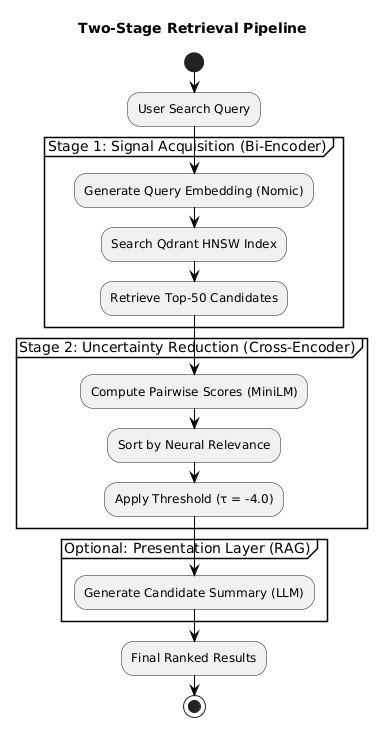

# Intelligent CV Screening {background-color="#18324a"}

## Cross-Encoder Reranking as Uncertainty Reduction

**Paper focus**

- Two-stage hybrid RAG pipeline for automated CV screening
- Cross-encoder reranking formalized as entropy-based uncertainty reduction
- 247,480 real-world CV profiles · 5-way controlled ablation study
- Locally deployable, privacy-preserving architecture

::: footer
Bi-Encoder + Cross-Encoder + RAG · Flask, Qdrant, Ollama
:::

## Why This Problem Matters {.smaller}

Screening thousands of CVs per job opening is labor-intensive and error-prone. Standard keyword-based Applicant Tracking Systems (ATS) fail at capturing semantic meaning:

- **False Negatives:** "Machine Learning Engineer" query misses "AI Developer" profiles
- **False Positives:** Keyword stuffing tricks the system (e.g., listing Python in a "Not interested in" section)

These errors reflect **information uncertainty**: a recruiter's query is an underspecified information need, and the ideal retrieval system should surface candidates whose relevance may not be lexically obvious.

::: center
 
> **Key question:** Can we bridge the semantic gap while keeping latency acceptable for real-time use?
:::

## Research Goal and Contributions {.smaller}

**Goal**

Design a two-stage retrieval pipeline that systematically reduces ranking uncertainty in CV screening.

**Main contributions**

- End-to-end two-stage pipeline (bi-encoder + cross-encoder reranker) optimized for unstructured, long-form PDF CVs
- Controlled five-way ablation study (BM25, Bi-Encoder, RAG, Reranker, Full) with consistent evaluation protocols
- Entropy-based ranking uncertainty formulation and empirical validation
- Fully functional, locally deployable web application achieving sub-200 ms latency

## System Architecture {.smaller .pipeline-overview-slide}

:::: {.columns}
::: {.column width="54%"}
{fig-align="center" height="520"}
:::

::: {.column width="46%"}
### Two-Stage Pipeline

1. **Stage 1 — Bi-Encoder Retrieval**
   Nomic embeddings + Qdrant Hierarchical Navigable Small World (HNSW) index → top-$k$ candidates

2. **Stage 2 — Cross-Encoder Reranking**
   Joint query–document attention → re-rank + threshold filtering

3. **RAG Presentation Layer**
   Generative LLM summaries without altering ranking order

### Design Goal

- coarse signal acquisition → fine-grained noise reduction
- modular architecture, locally deployable, privacy-preserving
:::
::::

## Two-Stage Retrieval Pipeline {.smaller}

:::: {.columns}
::: {.column width="48%"}
### Stage 1: Bi-Encoder

- Query & documents → $\mathbb{R}^{768}$ via Nomic embeddings
- Cosine similarity + Qdrant HNSW index → top-$k$ candidates
- Grouped retrieval, sub-50 ms, $\mathcal{O}(\log N)$
- **Limitation:** single vector compresses semantics, introduces ranking uncertainty
:::

::: {.column width="48%"}
### Stage 2: Cross-Encoder Reranker

- Joint query–document self-attention (MiniLM)
- Pairwise scoring, threshold $\tau = -4.0$
- Captures term interactions, semantic alignment, context
- Overhead ≈130 ms for 50 candidates
:::
::::

**Uncertainty reduction framing:** Stage 1 ≈ coarse signal acquisition. Stage 2 ≈ fine-grained noise reduction. Reranker resolves ambiguity where bi-encoder is least confident — an idea we formalize via Shannon entropy and validate empirically.

## Dataset and Technology Stack {.smaller}

:::: {.columns}
::: {.column width="48%"}
### Dataset Composition

| Property | Value |
|---|---|
| Total CV profiles | 247,480 |
| Job categories | 55 |
| Semantic chunks | 2,068,000 |
| Chunking | $W$ = 512 tokens, $O$ = 128 overlap |

- Source: Kaggle Resume Dataset
- **Silver-standard** binary labels from filename matching
- Fleiss' $\kappa = 0.71$
:::

::: {.column width="48%"}
### Technology Stack

| Component | Technology |
|---|---|
| API Layer | Flask 3.1 |
| Vector DB | Qdrant 1.12 (Docker) |
| Bi-Encoder | Ollama + nomic-embed-text |
| Reranker | ms-marco-MiniLM-L-6-v2 |
| RAG LLM | Ollama + local LLM |
| Frontend | Tailwind CSS |

- All local, privacy-preserving deployment
:::
::::

## Experimental Setup {.smaller}

### Five-Way Ablation Study

| Config | Stage 1 | Stage 2 | RAG |
|---|---|---|---|
| M1: BM25 | Sparse lexical (TF-IDF) | — | — |
| M2: Bi-Encoder | Nomic + Qdrant HNSW | — | — |
| M3: RAG-Only | Nomic + Qdrant HNSW | — | ✓ |
| M4: Reranker-Only | Nomic + Qdrant HNSW | MiniLM | — |
| **M5: Full Pipeline** | **Nomic + Qdrant HNSW** | **MiniLM** | **✓** |

### Evaluation Protocol

**50 intent-based queries** across 5 categories · 35 extended queries · Metrics: P@$K$, NDCG@$K$, MRR, R@50, Latency · Baselines: ColBERT, SPLADE, DPR

## Main Results {.smaller}

| Config. | P@3 | NDCG@5 | MRR | R@50 | Lat. (ms) |
|---|---:|---:|---:|---:|---:|
| M1 BM25 | 0.100 | 0.142 | 0.380 | 0.415 | **8** |
| M2 Bi-Enc. | 0.133 | 0.188 | 0.440 | 0.535 | 48 |
| M3 RAG | 0.133 | 0.188 | 0.440 | 0.535 | 95 |
| M4 Rerank | 0.240 | 0.265 | 0.512 | 0.535 | 178 |
| **M5 Full** | **0.267** | **0.282** | **0.530** | **0.535** | **185** |

 

**Key takeaways**

- Bi-Encoder beats BM25 (+33.0% P@3, +32.4% NDCG@5) — semantic embeddings > keyword matching
- Reranking is the dominant gain source: +80.5% P@3 over Bi-Encoder alone
- **Full pipeline: +100.8% P@3, +50.0% NDCG@5 over bi-encoder baseline**
- RAG does NOT alter ranking metrics — purely a presentation-layer enhancement

## Query Analysis and Robustness {.smaller}

| Query Type | M2 Bi-Enc | M5 Full | Gain |
|---|---:|---:|---:|
| Simple Keyword | 0.795 | 0.865 | +8.8% |
| Complex Contextual | 0.653 | **0.962** | **+47.3%** |

Largest gains on complex queries — **validates the uncertainty prediction**. Simple queries: bi-encoder already confident.

 

| Query | M2 Rank 1 | M5 Rank 1 |
|---|---|---|
| Senior Java Dev + Spring Boot | Chef | **Engineer** |
| Teacher + curriculum exp. | Teacher | **Teacher** (better match) |

Cross-encoder corrects bi-encoder's distractor-term errors (e.g., Chef ≠ Java Developer).

## Latency–Accuracy Trade-off {.smaller}

| Config | Latency | P@3 |
|---|---:|---:|
| BM25 | **8 ms** | 0.100 |
| Bi-Encoder | 48 ms | 0.133 |
| Reranker | 178 ms | 0.240 |
| **Full (M5)** | **185 ms** | **0.267** |

Full pipeline: highest precision at sub-200 ms — acceptable for interactive recruitment. Cross-encoder adds ≈130 ms; scales linearly with candidate set size (manageable at $k = 50$).

**RAG quality** (50 summaries): factual consistency 0.86 · hallucination rate 0.11 · recruiter usefulness 3.8/5

## Discussion: Three Key Observations {.smaller}

**1. Reranking as Uncertainty Reduction** ✓

Cross-encoder delivers largest gains on complex queries (+47.3% NDCG@5) where bi-encoder ambiguity is highest, with diminishing returns on simple queries (+8.8%). This empirically validates the entropy-based formulation.

**2. RAG is Presentation-Only**

RAG contributes to user experience via candidate summaries but does not improve retrieval quality. The generative component operates strictly at the presentation layer.

**3. Performance–Cost Trade-off**

130 ms reranking overhead is acceptable for interactive recruitment. Linear scaling with candidate set size means $k$ must be managed for production deployment.

## Comparison with Other Retrievers {.smaller}

| Config. | P@3 | NDCG@5 | MRR | Lat. (ms) |
|---|---:|---:|---:|---:|
| ColBERT | 0.250 | 0.275 | 0.522 | 290 |
| SPLADE | 0.200 | 0.242 | 0.478 | 118 |
| DPR | 0.142 | 0.195 | 0.448 | 52 |
| **M5 Full (Ours)** | **0.267** | **0.282** | **0.530** | **185** |

 

Our full pipeline outperforms dense (DPR), sparse-dense (SPLADE), and late-interaction (ColBERT) baselines while maintaining competitive latency. ColBERT achieves strong performance but at 290 ms — 57% slower.

## Limitations and Future Work {.smaller}

:::: {.columns}
::: {.column width="48%"}
### Limitations

- 247K CVs — generalization to 1M+ untested
- Coarse filename-based binary labels
- English-only CVs, no multi-modal input
- Cross-encoder cost scales with $k$
- Demographic bias not evaluated
- RAG assessed on metric neutrality only

:::
::: {.column width="48%"}
### Future Work

- XAI: perturbation-based word importance → recruiter transparency
- Recruiter-in-the-loop relevance feedback
- Multi-modal CV processing via LMMs
- Approximate reranking (late interaction) for scale
- Graded human-annotated benchmark
- Adaptive reranking: trigger Stage 2 only on high-ambiguity queries

:::
::::

## Conclusion {.smaller}

**Bottom line**

A two-stage hybrid retrieval pipeline (bi-encoder + cross-encoder reranker) systematically reduces ranking uncertainty in automated CV screening.

**Measurable results**

- **+100.8% Precision@3** and **+50.0% NDCG@5** over bi-encoder baseline
- **Sub-200 ms** end-to-end latency on commodity hardware
- Largest gains concentrated on complex contextual queries (where uncertainty is highest)

**Practical contribution**

A privacy-preserving, locally deployable system that bridges the gap between semantic retrieval research and real-world HR recruitment workflows.

# Thank You {background-color="#18324a"}

::: center

**Intelligent CV Screening with RAG and Cross-Encoder Reranking**

ericjuliantooo@gmail.com

 

{width="320"}

 

Questions?
:::
