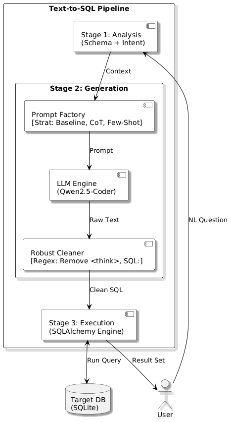
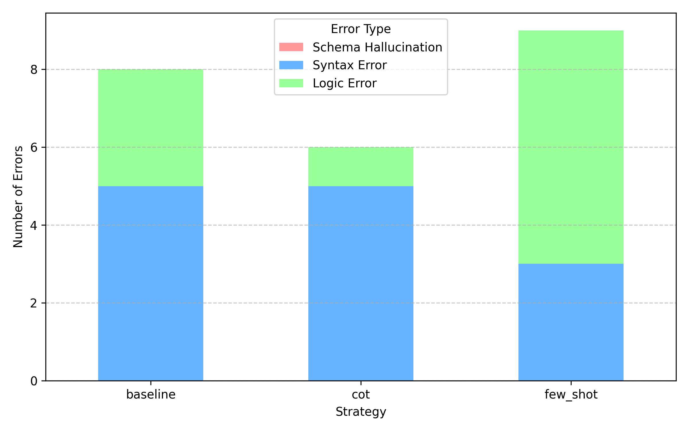

## Modular Design and Inference Benchmarking

**Paper focus**

- Transparent baseline for enterprise-oriented Text-to-SQL
- Modular pipeline with controllable validation points
- Benchmarking Zero-shot, Few-shot, and Chain-of-Thought on Spider

::: footer
DeepSeek-R1-8B, local deployment, reproducible baseline
:::

## Why This Problem Matters {.smaller}

Text-to-SQL is attractive because it lets non-technical users query relational databases in natural language. In practice, production adoption is still constrained by three recurring failure modes:

- Schema hallucination
- Invalid SQL syntax
- Opaque reasoning that is hard to audit

For enterprise use, raw fluency is not enough. The system must be grounded in the schema, validatable before execution, and easy to improve component by component.

## Research Goal and Contributions {.smaller}

**Goal**

Build a foundational Text-to-SQL pipeline that is simple, transparent, and suitable for controlled benchmarking.

**Main contributions**

- A modular pipeline separating intent handling, prompt construction, and validation
- A comparison of three prompting strategies using DeepSeek-R1-8B on Spider
- An error-oriented analysis showing where failures still concentrate

## Pipeline Overview {.smaller .pipeline-overview-slide}

:::: {.columns}
::: {.column width="54%"}
{fig-align="center" height="520"}
:::

::: {.column width="46%"}
### Three-Stage Flow

1. **Intent analysis and schema selection**
2. **Prompt construction and SQL generation**
3. **Execution-oriented validation**

### Design Goal

- keep the system modular
- expose validation checkpoints
- make failure sources easier to diagnose
:::
::::

## Stage Breakdown {.smaller}

:::: {.columns}
::: {.column width="33%"}
### Stage 1

**Intent Analysis and Schema Selection**

- Filter non-query inputs
- Rank relevant tables with TF-IDF
- Reduce prompt noise before generation
:::

::: {.column width="33%"}
### Stage 2

**Prompt Factory**

- Zero-shot baseline
- Static few-shot with generic examples
- Chain-of-Thought with explicit reasoning structure
:::

::: {.column width="34%"}
### Stage 3

**Multi-level Validation**

- Syntax checking
- Schema grounding
- Query execution against SQLite
:::
::::

## Prompting Strategies Compared {.smaller}

| Strategy | Core idea | Tradeoff |
|---|---|---|
| Zero-shot | Direct schema + question to SQL | Simple and efficient, but limited reasoning support |
| Few-shot (k=3) | Add static Question-SQL examples | Can help formatting, but may inject domain mismatch |
| CoT | Ask model to reason before SQL generation | Better planning, but higher token cost |

The benchmark asks a narrow practical question: which prompt format works best in a local, resource-constrained setup?

## Experimental Setup {.smaller}

:::: {.columns}
::: {.column width="48%"}
### Model and Environment

- Model: **DeepSeek-R1-8B**
- Inference: **Ollama**
- Deployment: **local 8-bit**
- GPU: **NVIDIA RTX 4060, 8GB VRAM**
- RAM: **64GB DDR5**
:::

::: {.column width="52%"}
### Evaluation Design

- Dataset: **Spider**
- Sample size: **150 queries**
- Difficulty coverage:
  - Simple: **52**
  - Intermediate: **64**
  - Complex: **34**
- Metrics: **Execution Accuracy**, **Validity**, **Average Tokens**
:::
::::

## Why Spider and Why Modular? {.smaller}

- Spider remains a strong cross-domain benchmark for cross-domain semantic parsing
- Multi-table queries expose join planning and grounding failures clearly
- A modular design helps isolate whether errors come from retrieval, prompt design, or validation

This is why the paper emphasizes diagnostic value over leaderboard chasing.

## Main Results {.smaller}

| Strategy | EX (%) | Valid (%) | Avg. Tokens |
|---|---:|---:|---:|
| Baseline | 63.3 | 71.3 | 842 |
| Few-shot (k=3) | 58.0 | 67.3 | 1,437 |
| CoT | **70.7** | **78.7** | 1,185 |

**Takeaway**

- CoT is the strongest strategy in this benchmark slice
- Static few-shot underperforms, likely due to domain-mismatch noise
- Better structure can matter more than simply adding examples

## Results by Query Complexity {.smaller}

| Complexity | Count | Base | Few | CoT |
|---|---:|---:|---:|---:|
| Simple | 52 | 82.7 | 75.0 | **86.5** |
| Intermediate | 64 | 59.4 | 54.7 | **67.2** |
| Complex | 34 | 41.2 | 35.3 | **52.9** |

The relative advantage of CoT becomes clearer as the SQL problem becomes more compositional.

## Error Distribution {.smaller}

{fig-align="center" width="62%"}

Key interpretation:

- **Schema hallucination** remains the dominant failure mode
- **CoT** reduces syntax errors by forcing explicit planning
- Reliability gains are real, but grounding is still the bottleneck

## Qualitative Case Study {.smaller}

In the "Concert" database example, the baseline model hallucinated the column **Highest** when answering a question about average and maximum stadium capacity.

CoT handled the same case better because it first reasoned about:

- relevant table selection
- aggregation targets
- the valid **Capacity** column

This is consistent with the broader quantitative pattern: explicit reasoning mainly helps avoid structurally avoidable failures.

## What This Benchmark Really Shows {.smaller}

The paper is not claiming a state-of-the-art Text-to-SQL system.

It shows that, under a practical local deployment setup:

- prompt design materially changes execution accuracy
- static few-shot examples can hurt when they are poorly aligned
- validation helps expose where the system still fails

That makes the pipeline useful as both an evaluation scaffold and an engineering baseline.

## Limitations and Future Work {.smaller}

**Current limits**

- Only 150 sampled Spider queries
- Single quantized 8-bit model
- No dynamic retrieval or repair loop yet

**Next steps**

- Dynamic context retrieval
- self-correction / repair loops
- more agentic execution workflows
- broader benchmark coverage beyond the current slice

## Conclusion {.smaller}

**Bottom line**

Chain-of-Thought provides the strongest overall performance in this foundational benchmark, especially on harder queries, but schema grounding remains the core unresolved challenge.

The practical contribution is a modular and auditable Text-to-SQL baseline that can be improved incrementally without turning the whole system into a black box.

# Thank You {background-color="#18324a"}
