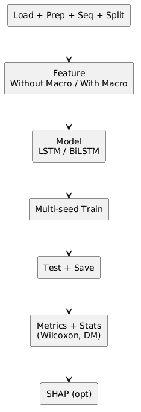
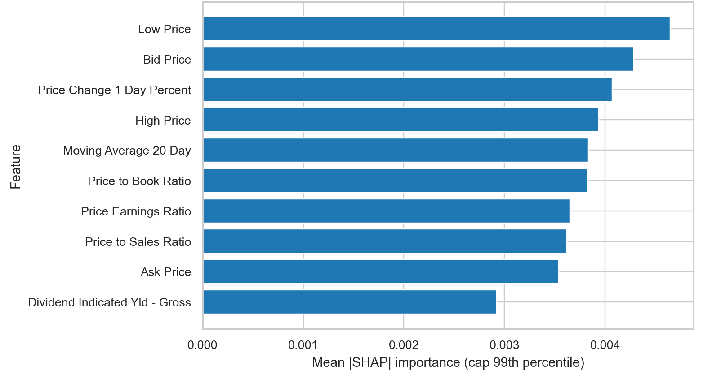
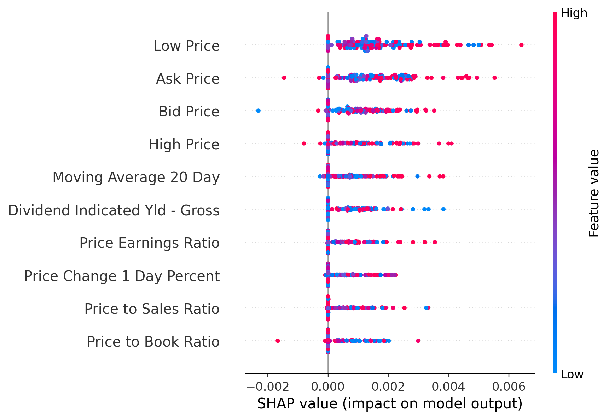

# GA-Driven Recurrent Modeling {background-color="#18324a"}

## Indonesian Banking Stocks Forecasting

**Paper focus**

- Reproducible benchmark for Indonesian banking stock forecasting
- Controlled ablation over architecture, macro features, and optimization
- Statistical validation plus SHAP-based explainability

::: footer
7 banks · 8 cases per bank · 5 seeds per case
:::

## Why This Problem Matters {.smaller}

Forecasting banking stocks is difficult because the series are non-stationary, regime-dependent, and affected by both price-side dynamics and external macroeconomic signals.

In practice, many forecasting papers still have three weaknesses:

- shallow ablation design
- weak statistical validation
- limited interpretability of the final model behavior

This work builds a stronger baseline before moving to more advanced architectures.

## Research Goal and Contributions {.smaller}

**Goal**

Test whether macroeconomic feature engineering and budgeted optimization produce reliable gains for LSTM-based forecasting of Indonesian banking stocks.

**Main contributions**

- Structured ablation over `LSTM` vs `BiLSTM`, `Without_Macro` vs `With_Macro`, and default vs `GA`
- Multi-bank, multi-seed evaluation protocol for robust comparison
- Wilcoxon and Diebold-Mariano significance tests
- SHAP layer for feature-level explanation and plausibility analysis

## Pipeline Overview {.smaller .pipeline-overview-slide}

:::: {.columns}
::: {.column width="54%"}
{fig-align="center" width="54%"}
:::

::: {.column width="46%"}
### Five-Stage Flow

1. **Data loading and scaling**
2. **Sequence generation**
3. **Model training**
4. **Out-of-sample forecasting**
5. **SHAP interpretation**

### Design Goal

- isolate source of performance gains
- compare model, feature, and tuning effects fairly
- keep the benchmark reproducible
:::
::::

## Experimental Setup {.smaller}

:::: {.columns}
::: {.column width="48%"}
### Scope

- 7 banking stocks:
  `BBCA`, `BBNI`, `BBRI`, `BBTN`, `BDMN`, `BMRI`, `BNGA`
- target:
  next-day closing price
- forecasting horizon:
  1 day
:::

::: {.column width="52%"}
### Evaluation Design

- 5 seeds:
  `42`, `52`, `62`, `72`, `82`
- metrics:
  `RMSE`, `MAE`, `MAPE`, `MSE`
- fair comparison:
  same splits, same seeds, same training budget
:::
::::

## Ablation Matrix {.smaller}

| Factor | Options |
|---|---|
| Model family | `LSTM`, `BiLSTM` |
| Feature regime | `Without_Macro`, `With_Macro` |
| Optimization | default, `GA` |

This yields:

$$2 \times 2 \times 2 = 8$$

cases per bank.

**Important question**

Do macro variables really help, or do they only work in selected issuer-specific regimes?

## Model and Optimization Design {.smaller}

:::: {.columns}
::: {.column width="50%"}
### Sequence Models

- single-layer `LSTM`
- single-layer `BiLSTM`
- dropout `0.2`
- linear prediction head

### Default Setup

- hidden size `64`
- learning rate `1e-3`
- sequence length `20`
:::

::: {.column width="50%"}
### Budgeted GA Search

- optimize hidden size, learning rate, sequence length
- population size `8`
- generations `5`
- total budget `40` configurations per case

GA is treated as an **optimization-effort ablation**, not as the central novelty claim.
:::
::::

## Main Results {.smaller}

| Bank | Best case | RMSE | MAE | MAPE (%) |
|---|---|---:|---:|---:|
| BBCA | `bilstm_without_macro` | `1881.53 ± 199.49` | 1721.55 | 18.36 |
| BBNI | `bilstm_without_macro` | `335.85 ± 57.51` | 252.66 | 4.90 |
| BBRI | `bilstm_without_macro` | `525.70 ± 123.24` | 435.44 | 8.34 |
| BBTN | `bilstm_without_macro_ga` | `51.44 ± 16.04` | 43.48 | 3.23 |
| BDMN | `lstm_without_macro` | `120.72 ± 21.92` | 98.32 | 3.74 |
| BMRI | `bilstm_with_macro_ga` | `1388.71 ± 257.96` | 1165.79 | 19.09 |
| BNGA | `bilstm_without_macro` | `244.14 ± 28.12` | 192.77 | 11.23 |

**Takeaway**

`BiLSTM` dominates in 6 of 7 banks, usually under `Without_Macro`.

## Statistical Validation {.smaller}

Baseline:
`lstm_without_macro`

| Bank | Improve (%) | Wilcoxon p | DM p |
|---|---:|---:|---:|
| BBCA | 8.76 | 0.4375 | `2.28 × 10^-13` |
| BBNI | 10.47 | 0.0625 | `4.84 × 10^-11` |
| BBRI | 28.23 | 0.3125 | `< 10^-16` |
| BBTN | 35.66 | 0.3125 | `2.22 × 10^-16` |
| BMRI | 11.18 | 0.4375 | `2.23 × 10^-11` |
| BNGA | 4.91 | 0.3125 | `4.78 × 10^-5` |

Key interpretation:

- `DM` strongly supports lower forecast error in most winning cases
- `Wilcoxon` is weaker because seed count is only `n = 5`

## Does Macro Help? {.smaller}

| Bank | LSTM delta (%) | BiLSTM delta (%) |
|---|---:|---:|
| BBCA | +20.34 | +27.87 |
| BBNI | +30.70 | +39.21 |
| BBRI | -1.27 | +23.19 |
| BBTN | **-5.04** | **-17.72** |
| BDMN | +202.86 | +126.82 |
| BMRI | -1.76 | -4.85 |
| BNGA | +13.25 | +15.45 |
| Mean | +37.01 | +29.99 |

Interpretation:

- Positive delta = degradation
- macro features are **not universally beneficial**
- improvements only appear in selected banks and regimes

## XAI Insight {.smaller}

:::: {.columns}
::: {.column width="50%"}
{fig-align="center" width="100%"}
:::

::: {.column width="50%"}
### Global SHAP Ranking

Most frequent dominant drivers:

- `Low Price` (39)
- `Bid Price` (31)
- `Price Change 1 Day Percent` (28)
- `Price to Sales Ratio` (28)

Short-horizon market microstructure features dominate more often than macro variables.
:::
::::

## Local Explanation Example {.smaller}

:::: {.columns}
::: {.column width="56%"}
{fig-align="center" width="100%"}
:::

::: {.column width="44%"}
### Best Checkpoint Pattern

- strongest local attribution view comes from the best-performing checkpoint
- explanation patterns remain bank- and regime-specific
- macro variables appear as top contributors only in a subset of runs
:::
::::

## What This Benchmark Really Shows {.smaller}

The paper is not only about beating a baseline metric.

It shows that:

- benchmark rigor materially changes the credibility of forecasting claims
- `BiLSTM` is generally stronger than `LSTM` in this setup
- `GA` helps in selected cases but not uniformly
- macro variables require better relevance and alignment, not blind feature expansion

## Conclusion {.smaller}

**Bottom line**

This study provides a reproducible and statistically grounded forecasting baseline for Indonesian banking stocks.

The strongest practical message is:

- `BiLSTM` usually wins
- macroeconomic variables do not help consistently
- explanation and significance testing are necessary to judge whether gains are real

# Thank You {background-color="#18324a"}
